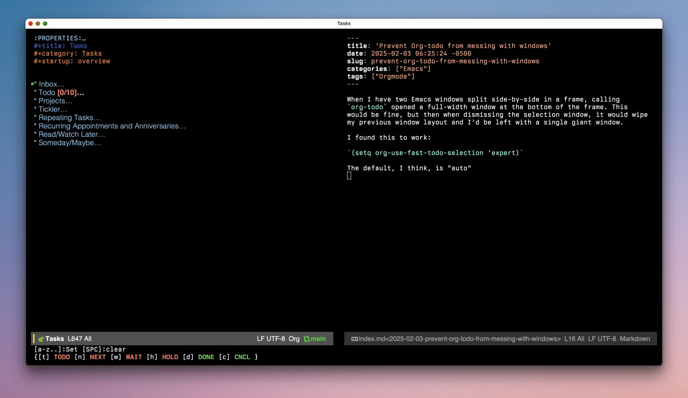

When I have two Emacs windows split side-by-side in a frame, calling `org-todo` opened a full-width window at the bottom of the frame. This would be fine, but then when dismissing the selection window, it would wipe my previous window layout and I'd be left with a single giant window. 

I found this to work:

`(setq org-use-fast-todo-selection 'expert)`

The default, I think, is "auto"

