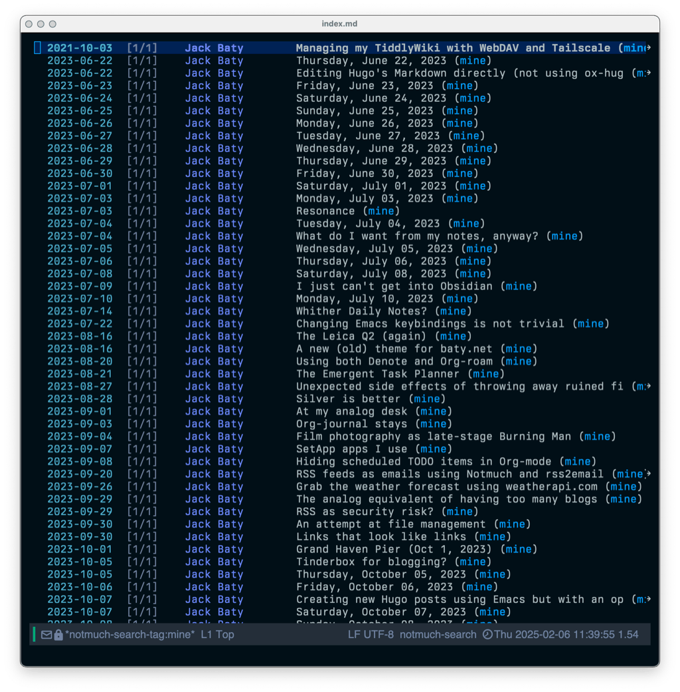

Now that I've solved my [Notmuch](https://notmuchmail.org) sync problems, I'm more inclined to move ahead with converting other content into emails and indexing them using Notmuch.

I thought I'd start with my blog posts.

<!--more-->

In 2023 I learned how to [convert an RSS feed into local emails](/posts/2023/09/rss-feeds-as-emails-using-notmuch-and-rss2email/) using [rss2email](https://pypi.org/project/rss2email). I've reconfigured that and it's working OK, but I still have a bunch of old blog posts I'd like to add to my notmuch database.

I asked ChatGPT for help creating a script that would take a folder full of Markdown files and convert them to local emails. ChatGPT did a surprisingly good job. A couple small tweaks and I had something working.

The script uses the `date:` and `title:` properties from the YAML front matter as the email date and subject.

I ran the script on my Hugo posts/content folder from baty.net. Just look at all this juicy email in Notmuch:



Some of the older posts must've had wonky dates, because the script choked on those and just used today's date instead. I'm not bothering to solve that problem right now.

Much like with the RSS imports, I don't want the imported files to show up in my inbox, so these lines in Notmuch's post-new hook does the trick. One for RSS and one for the converted posts:

```sh
notmuch tag +feed -inbox -- '(to:jack+rss@baty.net)'
notmuch tag +mine -inbox -- '(from:jack+blog@baty.net)'
```

This way they still show as unread, just not in my inbox. Note that none of these are ever actually synced to my Fastmail account. Everything remains local.

I put the scripts on Github, but they're not really meant for general consumption. Besides, who but me wants this, anyway?

[jackbaty/markdown2maildir](https://github.com/jackbaty/markdown2maildir/tree/main)

There's probably 1,000 other ways to approach this, but I had fun, and it's one more step toward having everything stored as emails, indexed with notmuch, and viewed in Emacs.
