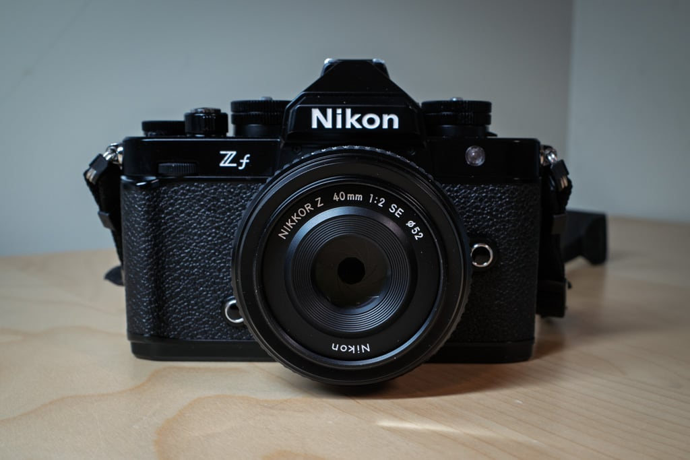
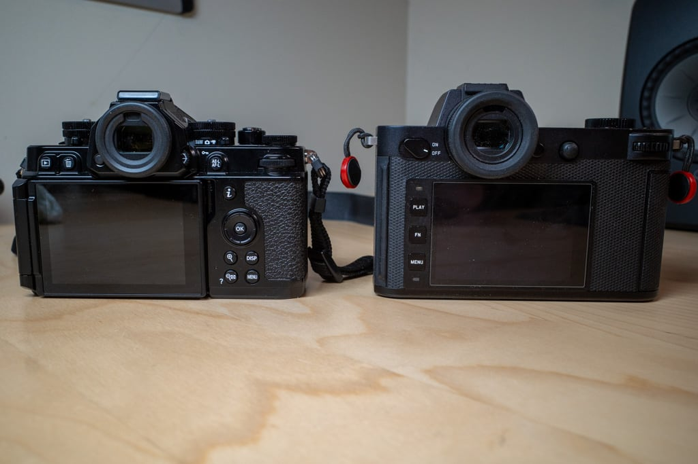
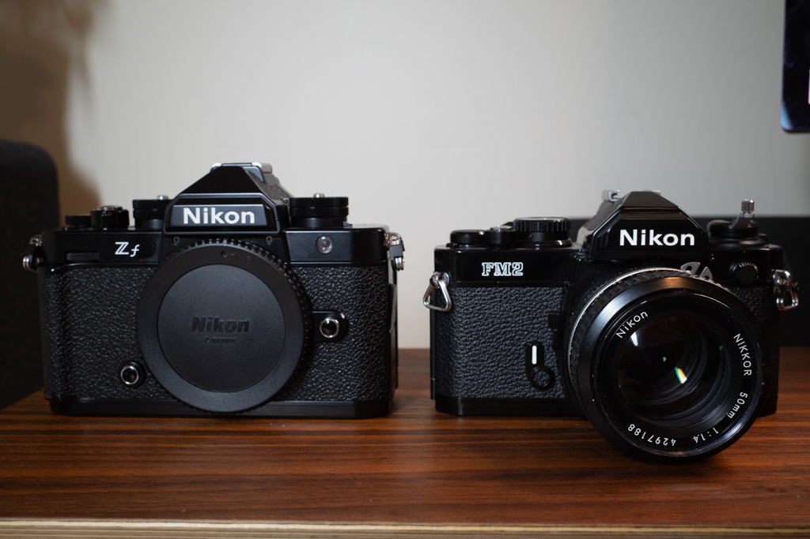
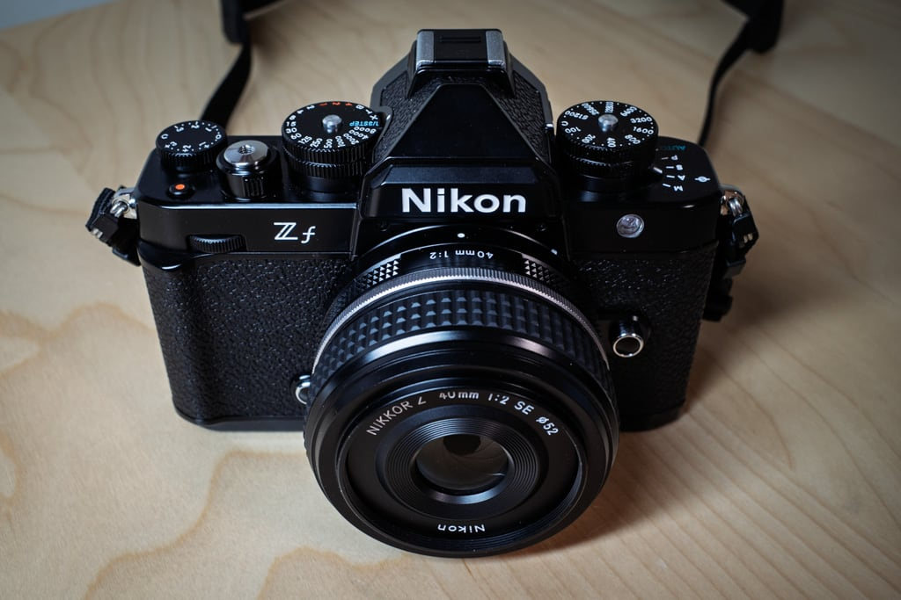

In a desperate attempt to spark some enthusiasm for photography, I bought a Nikon Zf. I know, this is not the best approach, but it's what I did so here we are. I'm jotting down a few quick thoughts and first impressions. (This isn't a review. Just notes to myself about the camera).

The Zf[^1] is meant to replace my Leica SL2. The SL2 is a terrific camera, but it's so big and heavy that I never take it anywhere. With the Zf being smaller and lighter, I figured it would make more sense as an "everyday carry" camera.

Except the Zf isn't really that small or light. It's about 200g lighter than the SL2. Put another way, it's a roll of nickels lighter. Or a Ricoh GRIII 😄. That may seem like a lot, but it isn't a night-and-day difference. Here are the two cameras, side-by-side.

As you can see, it's definitely smaller, but "smaller than huge" is still not _small_.

The Nikon is mostly metal, with cool brass knobs. I love real dials, which is why I chose this camera.

Except with the Zf the dials can lie. After a dozen YouTube videos and the Nikon manual, I can't for the life of me understand how Auto-ISO works. What I do know is some of the time, the number set on the ISO dial isn't the ISO the camera is going to use. As far as I can tell, sometimes it means Maximum ISO and sometimes it means Minimum ISO and sometimes it means the actual ISO. I kind of hate that. The easy solution is to leave it on "C" and just use the control dials like any other digital camera. But why buy the Zf, then? People who claim to understand Nikon's system say that it's better. I'm not yet one of those people. Plus, having both a PASM switch and manual dials is just weird.

The Zf looks great, especially from the front. There's a direct line between it and the early-80s FM2n. Here they are next to each other.

Nikon released only two lenses designed to match the Zf. I bought the 40mm f/2.0. Here it is on the camera:

See how nice it looks? Notice anything else? I do. I notice that it doesn't have an aperture ring. This might be the dumbest design choice they could have made. I mean, the plastic lens already feels like it came out of a Cracker Jack box, but the fact that it looks the part, but doesn't act the part is very disappointing.

Let's see, what else don't I like. The battery door feels cheap and flimsy. People rave about the metal construction and build quality of the Zf, but pick up the Leica and you'll quickly realize that they're not even in the same category, build-wise. The Nikon feels fine, but I've held Leicas, so comparisons are inevitable. The Nikon loses by a mile.

Whining aside, I'm starting to like the Zf. It focuses so fast! Even in low light. Noise has been a non-issue so far at higher ISOs. It beats the pants off the Leica in focusing and low-light performance.

I've been down with a cold since I got it, but I can't wait to try it with my toddler grandson, who never sits still.

The files look nice so far. 24MP is more than enough for me.

I can't wait to try some manual focus lenses on it. With the right adapter, it will provide focus confirmation and subject detection even with manual lenses. That's pretty cool.

Two days after getting the Zf, I thought I'd be returning it, but after just two more days, I'm now thinking I'll give it a bit longer to see if the things that bugged me on day one will turn out to be non-issues. I _want_ to like the camera!

Once I'm feeling better and have had a chance to get used to everything, I'll report back.

[^1]:  I think the official designation is "Nikon Z f" with a space between the Z and f but that looks dumb so I write it as Zf.
