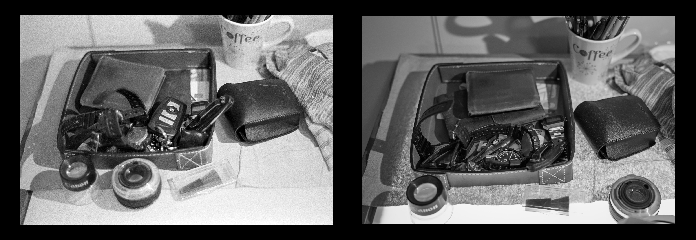

The other day, while bored, I shuffled around the house and burned through a roll of film, just for something to do. I took photos of random stuff that I use or see every day. The photos were boring af but, for some reason, because they're film I think they're kind of cool.

But are they? No, they're not. Film photography is fun, and the paraphernalia is awesome, but a boring photo is still a boring photo. Here's an egregious example. HP5 from the Nikon F100 on the left. Nikon Zf with an HP5 film recipe on the right.

I didn't spend time trying to get them to match. I just wanted to demonstrate how I sometimes trick myself into thinking film photos are somehow better, simply by virtue of them being film.

Honestly, I always prefer the photos on film, but that doesn't make them _good_.

The moral of the story here is that I should try making better photos, regardless of the medium.

