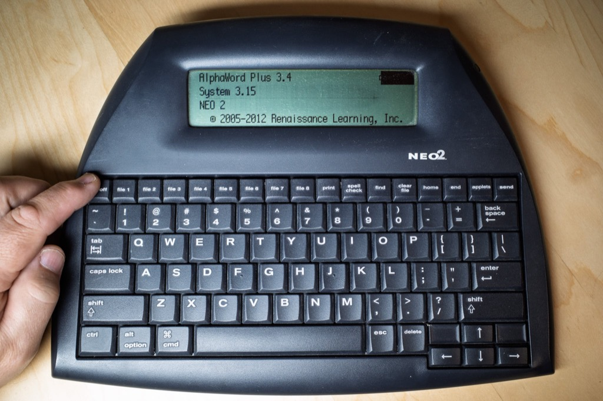

I started free writing again a couple weeks ago, but this time I'm doing it digitally, using the AlphaSmart Neo 2.

I dove hard into "Morning Pages" after reading Julia Cameron's [The Artist's Way](https://en.wikipedia.org/wiki/The_Artist's_Way), but it didn't last long. I mean, c'mon, there's no way I can consistently write 3 lined pages, longhand, every morning.

<!--more-->

The intended benefits of doing hard-core morning pages are lost on me, but I can get behind the practice of doing a little free writing each day. For me, it's more like forced journaling.

My version of morning pages is more like "Morning Pages Lite". I set a timer for ten minutes, press the On button, and start typing. Ten minutes is plenty long enough for me to uplug the tubes in my head. I'm not an artist, so that's all I need.

I haven't written morning pages longhand in quite a while. As much as I love journaling with fountain pens and paper, writing quickly for long periods as an exercise turns into a chore, and I don't enjoy it.

For some reason, I didn't post about it when I bought my first Neo, so I don't remember when I got it. Around 2012, I think. I remember paying $25.

For digital journaling, using the Neo is fun and quirky and about as far as one can get from writing on a computer. It shows only four lines of text at a time. The keyboard isn't fancy, but it's fine. If I want to transfer my writing to a computer, I plug in a USB cable, open my text editor, and press "Send", [like this](https://archive.baty.net/2018/alphasmart-neo-file-transfer/).

The last set of batteries I put in the Neo lasted nearly 3 years. That's 3 **years**!

Free writing for a few minutes in the morning is something I find useful. Changing the way I do it once it a while keeps it interesting.

