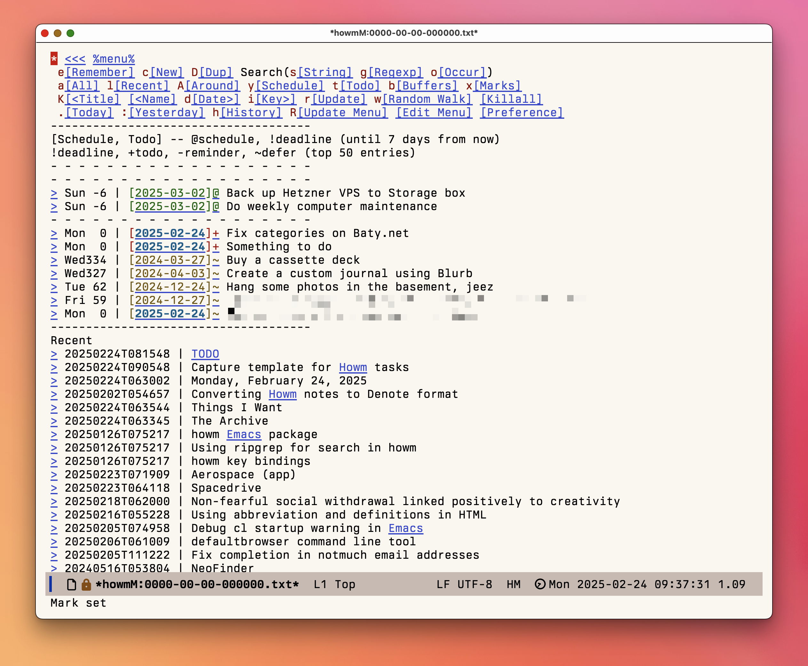

My use of [Howm](https://github.com/kaorahi/howm) has continued to grow organically. In other words, I don't set out to use Howm, it just happens :).

One of Howm's unique features is its TODO implementation:

<!--more-->

```
Format of schedule and todo:
[2002-10-21]@1  schedule -- (shown in schedule part. @3 = "3 days schedule to 10-23")
[2002-10-21]+7  todo -- float up slowly from the date in 7 days
[2002-10-21]!7  deadline -- float up fast from 7 days before the date
[2002-10-21]-1  reminder -- float at the date and sink slowly one unit per 1 day
[2002-10-21]~30 defer -- float at the date and repeat sinking and floating with 30 days period
[2002-10-21].   done -- sink forever
(Numbers after marks are default values.)

How to remember:
- Schedule at(@) the date
- Reminder sinks down(-).
- Todo floats up(+).
- Deadline needs attention!
- Defer waves(~) up and down.
- Done is the end(.).
```

These TODOs can be placed anywhere in any Howm file, but sometimes I just want to capture a task and have it added to an existing list of TODOs. I created a simple org-capture template for this:

```lisp
  ("h" "Todo to Howm" plain
           (file+headline , "~/Documents/Notes/Denote/Howm/20250224T081548--todo.org" "Inbox")
           "- [%<%F>]+ %?")
```

Running the capture template puts a new, dated TODO into a dedicated Howm TODO file. After a few uses for testing, it looks like this:

```
* Inbox
- [2025-02-24]. [2025-02-24]:+ Create capture template for Howm dates
- [2025-02-24]. [2025-02-24]:+ Move TODO file to root of Howm tree
- [2025-02-24]+ Fix categories on Baty.net
- [2025-02-24]~ Buy replacement hinges for laundry room
- [2025-02-24]+ Something to do
- [2025-02-28]@ Meeting with tax guys
```

They show up when needed on the Howm menu, like so:



At some point I should add a prompt for the date to use as well as the type of TODO, but for now, it's a small, useful quality-of-life improvement.
