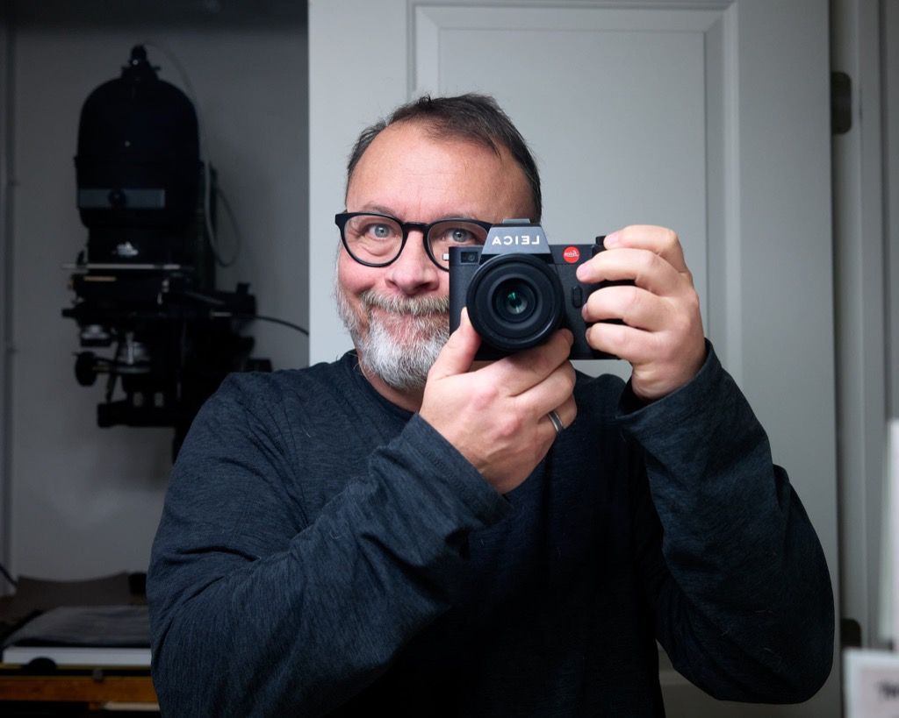

When I [bought the Nikon Z f](/posts/2025/02/the-nikon-zf/) recently, the way I intended to offset the cost was to sell the [Leica SL2](/posts/2023/02/leica-sl2/). The mistake I made was to buy the Nikon _before_ selling the Leica.

Yesterday, I gathered up the SL2 with accessories and took some photos of it for the listing. Picking up the camera reminded me that, as nice as the Z f is, it's not in the same league as the SL2. Everything about the Leica feels nicer. Controls, covering, grip, doors, battery, all of it.

I've been lost in the Nikon's menu system for a week. I still don't know where anything is. There's more "stuff" _available_ on the Nikon, but the Leica's menus are simple, clear, and easy to understand. Sometimes less is more, you know?

I started to reconsider the move to Nikon for my digital photography.

On the other hand, the Z f is significantly smaller and  lighter. Accessories are less expensive. The RAW files look good, and are much smaller (due to being 24MP vs 47MP, sure, but still). It's better at everything in low light. And auto-focus with the Nikon is miles ahead of the Leica. Eye detection with continuous auto-focus is a thing to behold.

I'm keeping both cameras.

The Nikon is for everyday stuff. It's perfect for the dog and my grandson and out-and-about photography. The Leica will remain for more "serious" things like studio portraits, which I want to do more of.

That's settled then. 😉.

