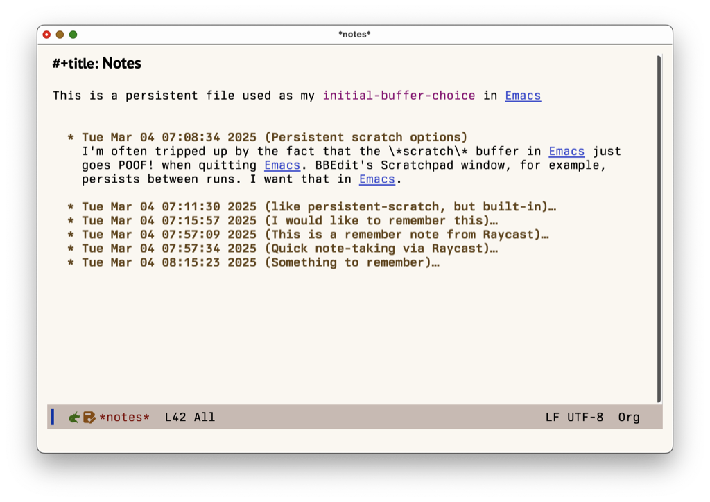
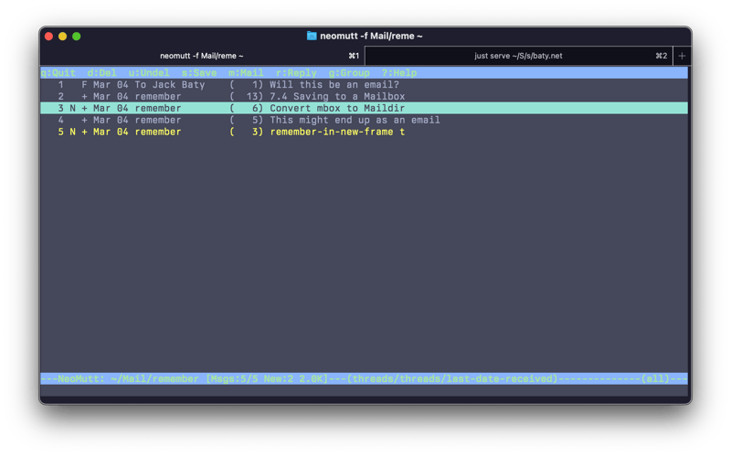

I went down a rabbit hole with the built-in [Remember mode](https://www.gnu.org/software/emacs/manual/html_mono/remember.html) in Emacs today.

<!--more-->

## Persistent Scratch with remember-note

The Emacs \*scratch\* buffer is handy. It's always available and easy to get to. However, by default it doesn't persist between runs of Emacs. So, when I quit Emacs, anything in the scratch buffer is lost. Sometimes I get burned by this, so I thought I'd fix it using the [persistent-scratch](https://github.com/Fanael/persistent-scratch) package.

While looking for details about the package,  I spotted a couple comments about using the built-in `remember-notes` function instead.

> Return the notes buffer, creating it if needed, and maybe switch to it.
> This buffer is for notes that you want to preserve across Emacs sessions.
> The notes are saved in ‘remember-data-file’.

OK, I tried it and it works great.



I now have a persistent Org mode file as my scratchpad, and I can easily capture new notes as org headings to it using `remember`.

## New frame defaults

Now that I had a nice, persistent scratchpad, I wanted it to be the default buffer for new frames and at startup. Easy enough:

```lisp
;; Persistent notes (like persistent-scratch, but built-in)
(setq initial-buffer-choice 'remember-notes
   remember-data-file "~/Documents/Notes/remember-notes"
   remember-notes-initial-major-mode 'org-mode
   remember-notes-auto-save-visited-file-name t
   remember-in-new-frame t))

(defun my/switch-to-scratch-buffer (f)
  (with-selected-frame f
    (remember-notes t)))
 
(add-hook 'after-make-frame-functions #'my/switch-to-scratch-buffer)
```

I'm not sure all of that is necessary now that I've learned about `remember-in-new-frame` but it works as-is, so I'll leave it.

## Remember mode via Raycast for system-wide capture

I'd created a keymap (`C-c o n`) for bringing up the remember-notes buffer while in Emacs, but thought it would be nice having a system-wide option. I've never understood how to configure =org-protocol= so I cheated and created a Raycast script:

```bash
#!/bin/bash

# Required parameters:
# @raycast.schemaVersion 1
# @raycast.title Remember
# @raycast.mode silent

# Optional parameters:
# @raycast.icon images/emacs.png

# Documentation:
# @raycast.description Open Emacs remember in new frame
# @raycast.author Jack Baty
# @raycast.authorURL https://baty.net

emacsclient -e "(remember-other-frame)"
```

Now I can trigger Raycast, type part of "Remember" (usually just "R" is enough) and it brings up a new Emacs frame containing the remember buffer. I type or paste whatever, and hit `C-c C-c` which adds the note to the remember file and kills the frame. Handy!

## Creating emails via Remember mode

While reading the Remember manual, I spotted the option to save Remember notes as emails. WUT?!

```lisp
(add-to-list 'remember-handler-functions 'remember-store-in-mailbox)
```

By default, this uses an mbox file, `~/Mail/remember`, which I can use Mutt to view.

`neomutt -f ~/Mail/remember`



Crazy, right? Yeah, I'm not going to view my captured notes in Mutt, but it's cool that I _could_. But it got me thinking about my urge to put everything into [Notmuch](https://notmuchmail.org). Notmuch indexes Maildir-formatted emails, not mboxes. What if I converted the mbox to Maildir and used Emacs to read the notes where I'm _already_ reading my emails? Plus super fast search and tagging, etc.?!

I've not gotten to that yet, but it's something to think about.

## Now what?

This whole thing started because I wanted to make my scratch buffer persistent. Instead, I've ended up with a whole new capture setup for quick notes.

Why not use Org-capture or Howm-remember or a million possible other things for this? Fair question. The answer is that I didn't know anything about Remember mode when I woke up this morning, and now I do. It remains to be seen whether I _should_ have used Org-capture for this, but it was fun learning how to do it this way.

It's possible we've, er, forgotten about Remember mode too soon.
