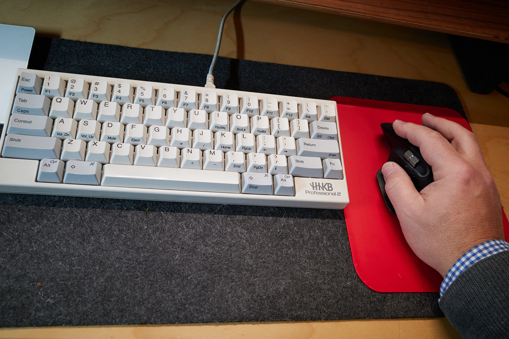

I like having a felt pad on my desk, but I don't like how it sometimes causes mouse movements to become choppy. 

My favorite mouse is the Logitech MX Master. Maybe other mouses work better on felt, but I want to use this one, so I decided to buy a mouse pad. Then I remembered I have a 3D printer.

I downloaded [this model](https://makerworld.com/en/models/220875-mouse-pad#profileId-411725) and an hour later I had a custom-sized simple mouse pad and it works great.

