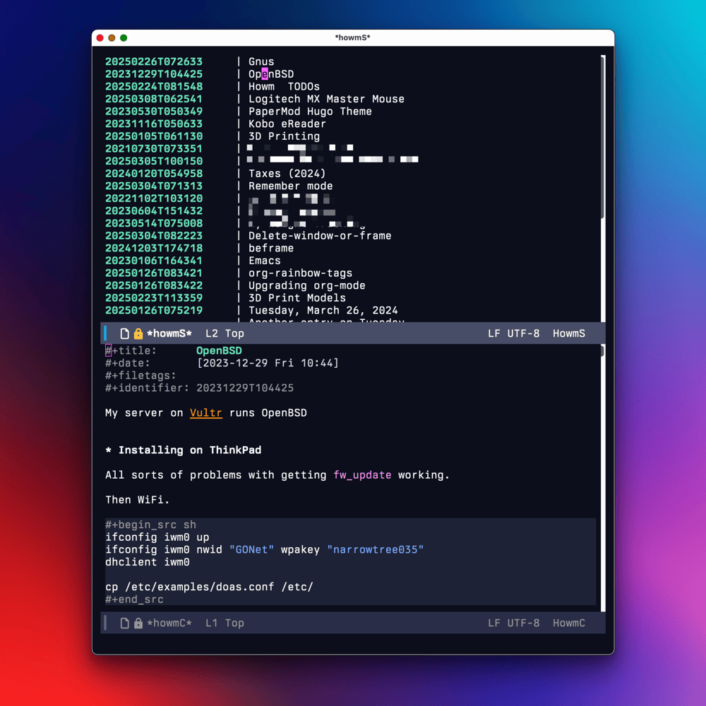

Long story, short: I'm using both [Howm](https://github.com/kaorahi/howm) and [Denote](https://protesilaos.com/emacs/denote) for notes in Emacs. But why? Below are some quick notes about why (with some "how" thrown in).

Denote is such a pleasure to work with. It's simple, powerful, and sensible. There are no dependencies or gotchas.

Howm is clever and interesting and fun. It offers a useful new take on both writing and reading notes. As a long-time fan of the [Noguchi filing method](https://archive.baty.net/2005/noguchi-filing-system/), Howm resonated with me immediately.

For a couple of months, I was using both packages independently. My thought was that I'd use Howm for quick, "fleeting" notes and Denote for my personal notes, projects, and "topic journals". This worked well enough, but it meant that every new note required a decision. Plus, looking for notes meant searching 2 places. My dream has always been "Everything in one place" so keeping them separate wasn't ideal.

The trick for me was learning a way to make my Howm notes look just like Denote notes, and then manage them all using Denote. Here's a summary of what that involved.

Both Howm and Denote can be configured to use any kind of note format (e.g. Org mode, Markdown, etc.). 

Recent versions of Howm have some built-in configuration for using Org mode files. This sets some basic configuration. Here's how to do that:

```lisp
(require 'howm-org) ;; Write notes in Org-mode.
```

And here's a subset of what that does for you:

```lisp
;; From howm-denote-el
(setq howm-file-name-format "%Y-%m-%d-%H%M%S.org")
(setq howm-view-title-header "*")
(setq howm-dtime-format "[%Y-%m-%d %a %H:%M]")
(setq howm-menu-file-extension ".org")
```

That's not Denote's file name format, so after requiring howm-org, I added the following:

```lisp
(setopt howm-file-name-format "%Y%m%dT%H%M%S.org")
```

That's not exactly Denote's format, but the proper date string means that Denote will at least recognize it as a Denote file. 

The next change was to modify the default header format to use a real `#+title: ` because by default it uses a top-level heading ("*"):

```lisp
(setopt howm-view-title-header "#+title:")
```

Doing that really messes with the Howm-menu and other howm lists. Buried in the comments in [issue #33](https://github.com/kaorahi/howm/issues/33), I found functions (by [@mmarshall540](https://github.com/mmarshall540)) that work around this nicely.

```lisp
;; Advise `howm-view-item-basename' so that if its return value
;; includes "--", only the text before is returned.
(defun my/howm-basename-chop (str)
  "Advice for `howm-view-item-basename'.
Takes a file's basename, STR, and returns only the portion before
\"--\"."
  (let ((dashes-pos (string-match "--" str)))
    (cond (dashes-pos (substring str 0 dashes-pos))
          (t str))))

(advice-add 'howm-view-item-basename :filter-return
            'my/howm-basename-chop)


;; Advise `howm-view-item-summary' so that it removes the "#+title: "
;; portion of note titles.
(defvar howm-view-title-regexp)
(defun my/howm-cut-title (str)
  "Remove `howm-view-title-header' plus whitespace from STR."
  (let ((begin (when (string-match howm-view-title-regexp str)
                 (match-beginning 2))))
    (if begin (substring str begin) str)))

(advice-add 'howm-view-item-summary :filter-return 'my/howm-cut-title)
```

With that, note listings in Howm look perfect. Note that the best fix for all this is to simply always use Denote for creating files, but I'd already configured things before I decided to combine both sets of notes. Besides, now I can create notes using either method. For any files created using Howm, I do need to rename them, but that's easy enough in a Dired buffer using `denote-dired-rename-marked-files-using-front-matter` once in a while (or from within the buffer while taking the note, if I think of it).

Also in that thread is a function (also from mmarshall540) for converting existing Howm notes to use `#+title: ` instead of "*" or "=". This worked great for me. [here's the comment](https://github.com/kaorahi/howm/issues/33#issuecomment-2629086415).

The final change was to make `howm-directory` and `denote-directory` the same directory.

That seems like a lot, but it's easier than it looks. 

Now my Howm Menu and note lists look like they're supposed to, even though they're actually full Denote-style files and have `#+title: ` in the first line.



Why am I doing this again? Well, because I get the best of both worlds this way. I create notes using Denote as normal, but then I can review them easily using Howm. And I also get all the same Howm tricks with `>>>` and `<<<` links.

I haven't worked out when or if to use the Howm TODO features. They're cool, but I'm pretty invested in my Org agenda. I'm testing the idea of using Howm TODOs for "someday/maybe" tasks, using the "~" notation in Howm. This surfaces the someday stuff without distracting from my gotta-do stuff. 

Still noodlin' on all this. It would be cool if someone better at this stuff than me would create a howm-denote.el package or something that encapsulated all this in an easy, consistent way.

