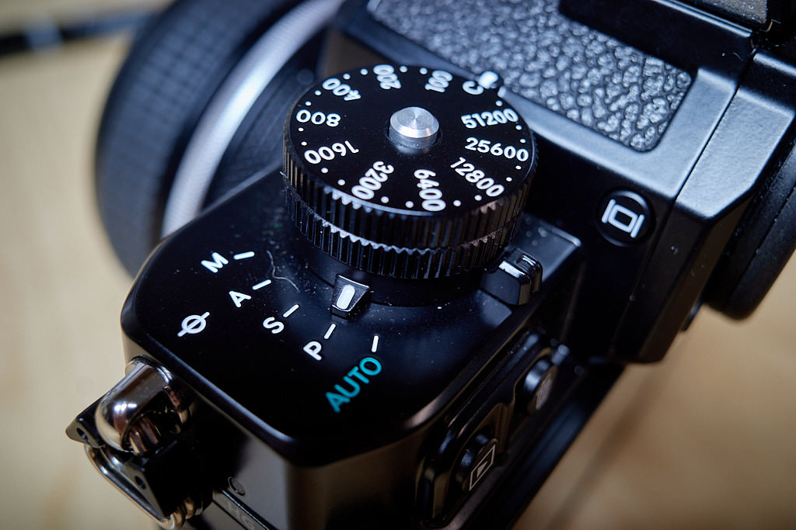

I bought the Nikon Z f thinking it would replace my Leica SL2, since the Nikon is lighter, newer, cheaper, and faster. While it is all of those things, it's still not _better_.

**Here's what I like about the Z f:**

- The design is just the right amount of retro.
- Autofocus is fast and accurate. Even in low light.
- High ISOs are very usable.
- The dials feel good.
- The RAW files look good out of Capture One without much work.
- It's nice having a flippy screen, even though it's the wrong style of flippy screen.
- It's lighter than the SL2.

**Here's what I don't love about it:**

- While smaller than the SL2, it's not a small camera.
- The menus are too complex. I still can't find anything. Use a modern Leica for 10 minutes and you'll see what I mean.
- The Auto ISO features confound me at every turn. So much so that I've set them once, and I never touch the nice, big, well-made dial for setting ISO.
- There's no aperture dial on the made-for-the-Zf lenses. A huge miss. I find myself just keeping the mode set to "P" (for "Professional" right?).
- Auto focus is fast and accurate, but the settings to make them fast and accurate require study. Too much study.
- The battery/SD door is flimsy and horrible, and with the (almost mandatory) grip attached, I struggle to pull the card out.
- I wish the dials worked like the Fuji system's dials. Yes, I know, these are more flexible, but if they don't make sense to me, I'm not using them.

If I sell the camera now, I'll lose my ass. But if I don't learn to like it more, the money might be better spent elsewhere, even at a loss.

Also, I haven't sold the SL2, yet.
