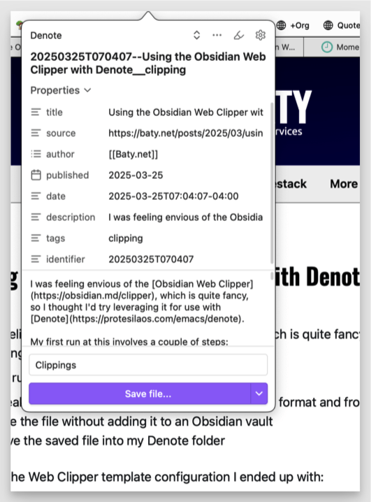

I was feeling envious of the [Obsidian Web Clipper](https://obsidian.md/clipper), which is quite fancy, so I thought I'd try leveraging it for use with [Denote](https://protesilaos.com/emacs/denote).

My first run at this involves a couple of steps:

-   Tweak the web clipper to save files using Denote's format and front matter
-   Save the file without adding it to an Obsidian vault
-   Move the saved file into my Denote folder

Here's the Web Clipper template configuration I ended up with:



It was important to set the "Tags" property type to "Text" rather than the default "Multitext" so that Denote does the right thing with it when renaming the file later.

In the Web Clipper's advanced settings, I set the behavior to "Save file..." rather than "Add to Obsidian".



OK, so now after using the Web Clipper, I get a Markdown file[^1]with a (mostly) Denote-compatible file name and front matter in my ~/Downloads folder. Here's what clipping this post looks like:

To get the file into my `denote-directory`, I use a rule in [Hazel](https://www.noodlesoft.com/). Hazel watches my Downloads folder for any new file whose name contains the string "\_\_clipping", and automatically moves it into a "clippings" folder in my Denote folder.

The only manual step remaining is to finish renaming the files using Denote. I don't yet know how to have the Web Clipper "slugify" the file name, so I have Denote do it. This can be done in batch using Dired, so it's not a huge burden.

If there's a simpler way to get a nicely-formatted Org mode file from a web page directly to my Denote folder, I'm all ears, but for now...

Take that, Obsidian! 😄

[^1]:  Denote handles Markdown files natively, so this is fine.
