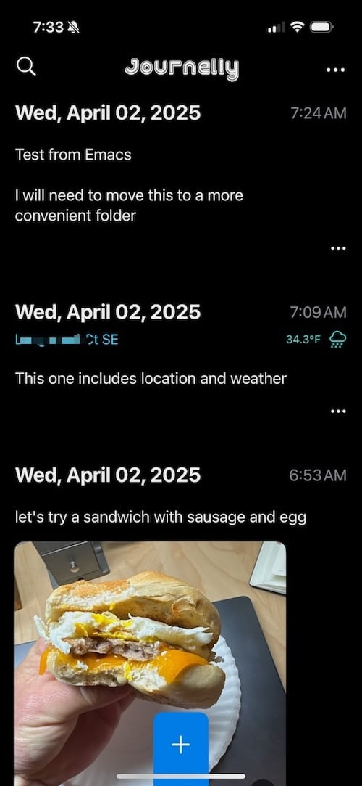

I saw the [Irreal post about Journelly](https://irreal.org/blog/?p=12842), but mostly ignored it because I wasn't looking for a new iOS journaling app. He did mention that Journelly is by [Álvaro Ramírez](https://lmno.lol/alvaro), author of [Plain Org](https://plainorg.com), [lmno.lo](https://lmno.lol/alvaro)l, and others, so that made things more interesting.

What intrigued me most, though, was learning that Journelly is backed by plain-text Org Mode files. Bonus! Now it had my attention.

Álvaro was kind enough to let me [into the TestFlight](https://lmno.lol/alvaro/journelly-open-for-beta), and I'm putting it through its paces this morning.

Here's what mine looks like so far...



Simple and easy to use, so that's good. As Álvaro desribed Journelly, it's like a personal, private Twitter/Instagram/Mastodon account.

Speaking of simple, the entire journal is kept as a single journelly.org file. I chose to sync mine via iCloud, which meant that I could view and edit it locally on my Mac. The problem with iCloud Drive's default storage locations is that they're in a stupid place, e.g. `/Users/jbaty/Library/Mobile Documents/iCloud~com~xenodium~Journelly/Documents/Journelly.org`. Don't make me create symlinks, iCloud! 😄

Digging into the settings, I noticed that in addition to the default iCloud Drive folder, I could configure Journelly to use any folder in iCloud, including my ever-popular `~/Documents/Notes` folder. Much better.

Since I use Emacs for most everything, including my journals, I've never done much journaling on my Phone. Journelly could change this equation. 

It would be cool if I could use Journelly from my Mac as well. To that end, I created an Org Mode capture template to make it easy to add entries while in Emacs on my Mac.

```lisp
("j" "Journelly Entry" entry
           (file "~/Documents/Notes/Journelly/Journelly.org")
           "* %U @ -\n%?" :prepend t)
```

I can now hit `C-c c j` and I'm in a capture buffer for the Journelly file. The Journelly app can include weather and location to new entries. Currently, my capture template isn't smart enough to do that, but it _could_ be, with just a bit of work.

It's only been a couple of hours with Journelly, so this isn't meant to be a review, but first impressions are that it's handy, simple, and could work well as an adjunct to my existing Org mode based note-taking setup.

For a recent review of Journelly, see [Monday App Finder: Journelly, a Twitter-Like Journal for iOS - The Mac Observer](https://www.macobserver.com/tips/round-ups/journelly-journal-app-ios/).

