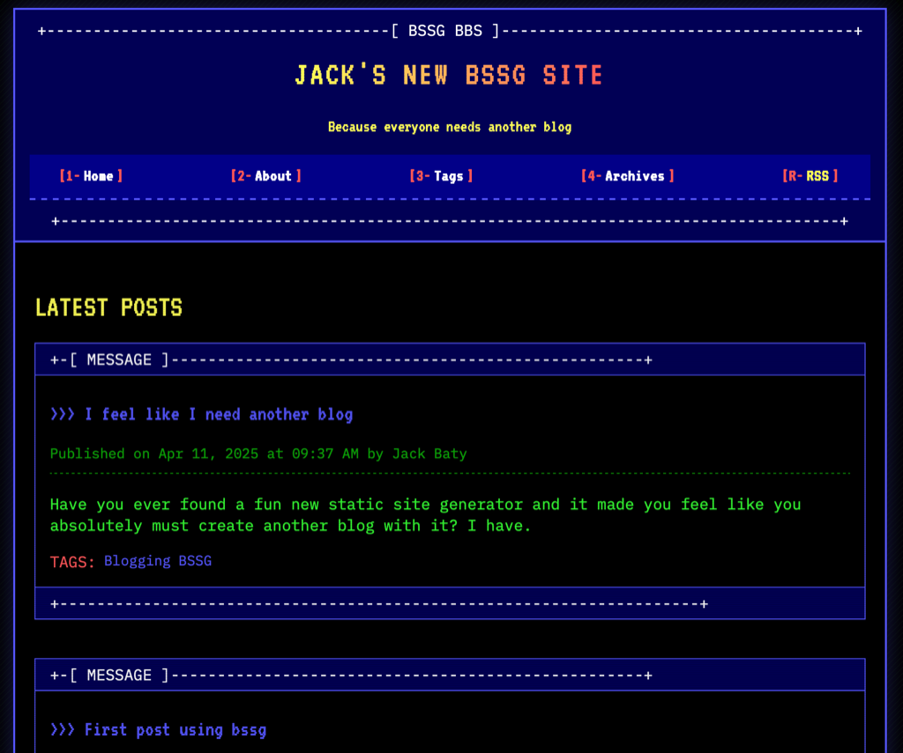

Today I learned about [BSSG](https://brew.bsd.cafe/stefano/BSSG), a static site generator written using Bash.

I've been chugging along with Hugo for a minute, but you just know I have to try every new thing I discover, so...

[bssg.baty.net](https://bssg.baty.net)

How fun is that!?

Written by Stefano Marinelli, BSSG is so simple and easy to use that I had a blog started in, I swear, two minutes. The only thing I had to do was change `MARKDOWN_PROCESSOR` to use pandoc, and I was off and running. Nice.

But there a lot of SSGs out there. Why BSSG? It's the themes! Every blogging platform for the past 10 years has featured themes that feel like a personal branding exercise. Like something you'd want to feature on your LinkedIn profile. Gross.

BSSD has like 50 themes ready to go. Many of them are so weird and retro that I fell in love. I mean, look at the "BBS" theme...

I don't need a new blog, and I promised myself I'd keep baty.net on Hugo, but damn, I feel like finding a use for this, just for the fun of it.