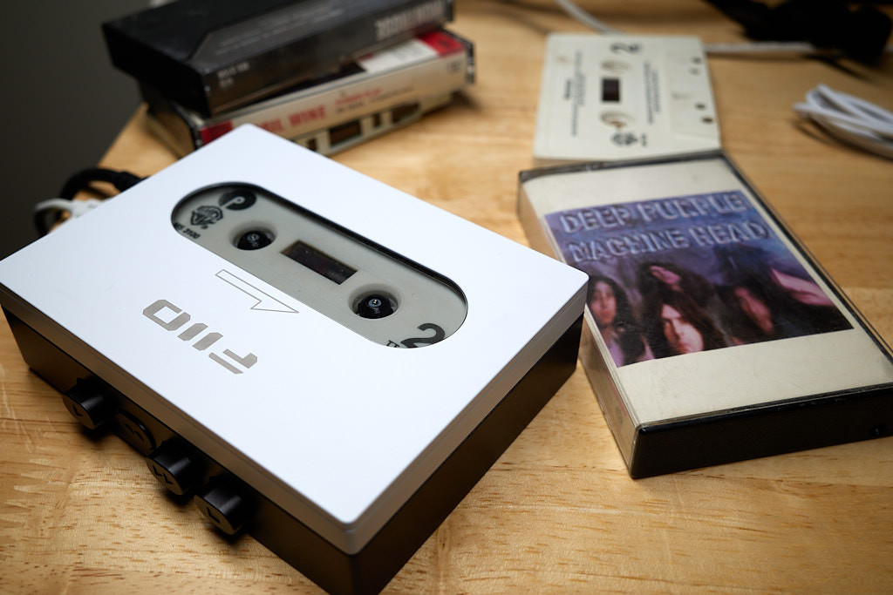

Nostalgia is some powerful stuff, ain't it?

My old Nakamichi cassette deck stopped working a few years ago, and I never bothered to replace it. I've been into vinyl and still have a good CD transport, so I didn't see a need for cassettes.

Occasionally, though, I'll spot a cassette somewhere and think I might like to bring mine out and play them. I didn't want some ancient "vintage" cassette deck, and I didn't want to spend much.

Enter the [FiiO CP13](https://www.fiio.com/cp13).



I impulse ordered one after watching someone review theirs on YouTube or somewhere. "I NEED THAT!" I said :).

It arrived, so I quickly went to grab my 1980s cassette case with all my cassettes. Except I couldn't find it. I looked everywhere. Nothing. All I found was a tote back with a dozen or so "rejects". Tapes I'd recorded myself, broken tapes, or just things I stopped liking.

Now, I _know_ I wouldn't throw away my tapes, so I'm sure it'll turn up. In the meantime, I'm entertaining myself with the rejects. This meant fixing the ones I have. All of my cassettes are at least 40 years old. The problem I see most is missing pressure pads. I ordered [a fix-it kit from Amazon](https://www.amazon.com/dp/B07WT8VDFD) and set to repairing what I could.



I'm listening to a bunch of Aerosmith tracks I recorded off something in 1980.

I can't tell you how the player sounds, because my tapes are in such poor shape that it's impossible to know if it's the player or the tape. What I will say that I'm having a blast with it.

