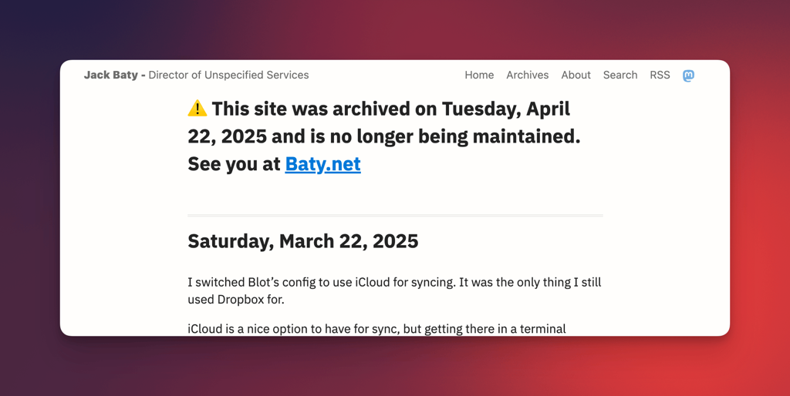

I started using [Blot](https://blot.im) for my blog in 2017. Blot is a really nice way to publish a blog from a folder full of Markdown files. Blot's author, David, is exceptionally helpful.

This morning I made an offline backup of everything and deleted all the content from Blot's folder. Then I canceled my subscription.

Five minutes later, I restarted my subscription. I'm grandfathered in to the original $20/year pricing, so I decided it's so inexpensive that it's worth twenty bucks just to have it available. Also, it supports a great project by a nice developer.

The original content has been archived[^1] as a static version and moved to [blot.baty.net](https://blot.baty.net) for posterity.

I don't know what I'll use it for, but Blot isn't something I'm ready to give up completely, yet.

[^1]: I created a static site using wget: `wget -mirror -F -E -k -p https://baty.blog`
