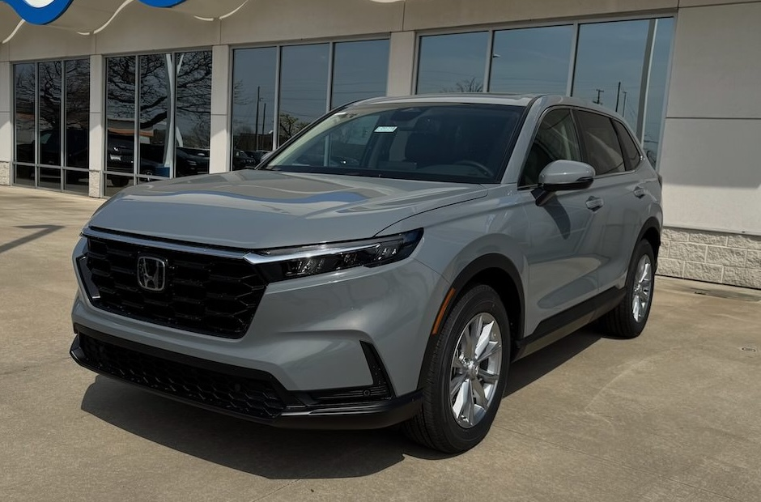

I bought a new car today. Before we get to that, I'd like to tell you about my old car.

Ever since I've been able to drive, I've been fascinated by BMWs. Reading Car and Driver magazine from cover to cover was a monthly routine. Car and Driver loved BMWs.

BMW was marketed as "The Ultimate Driving Machine" and I believed it.

In 2019 I was shopping for used car. I walked into the local CarMax intending to buy a Jeep Grand Cherokee. As we were walking around the lot, I spotted a black 5-series BMW and thought it would be fun to take a look. I asked how much they wanted for it, and it turns out that BMWs depreciate wildly in the first few years, because the price for the 2016 BMW was comparable to the Jeep I had my eye on. In other words, it was within my budget.

I looked at the car and thought, "Wow, that's gorgeous." I sat in the car and thought, "Man, this is nice!" I drove the car and said, "Ok, I want it."

So for the past six years I've been a BMW driver. The car is everything I'd hoped for. It's beautiful, perfectly proportioned, and aggressive-yet-restrained. Fit and finish is outstanding and it's the most fun I've ever had while driving. 

 :)")

It's also been surprisingly reliable. At nearly 90,000 miles, it remains solid and problem-free. I've only had one minor non-routine repair. There are no squeeks, rattles, or other faults with the car. It's still a blast to drive. It's just _tight_, you know?

But there was a problem. I know I shouldn't worry about it, but there's a stigma associated with BMW drivers. Especially drivers of black BMW sedans. Many people assume that all BMW drivers are assholes. It's a Douche-mobile. 

Try as I might, I could never shake the feeling that I was being judged. I go out of my way to drive politely, correctly, and defensively. I conduct myself on the road as if it's my personal duty to rid the world of a misconception. Except I don't know that it's a complete misconception. A lot of BMW drivers _are_ assholes. It's a group I grew tired of being associated with, whether the stigma was justified or not.

Given that the car is going on 10 years old, I decided to start shopping for a replacement. BMW repairs are notoriously expensive, and I wanted out of the feeling that at any moment I could be in for thousands of dollars of repairs. I wanted the opposite of a BMW. I wanted reasonably-priced, reliable, and boring. I wanted to be invisible.

I wanted a Honda.

The first car I ever bought was a 1976 Honda Civic.

")

I've owned a number of other Hondas.

- 1976 Honda Civic
- 1990 Honda Civic
- 1994 Honda Accord
- 2006 Honda Civic
- 2009 Honda Accord Coupe

All but the first one were great, reliable, solid cars.

So I bought a new CR-V.

I've only ever bought one brand new car, and told myself I'd never do that again because it's financially unsound. Except the used auto market has changed since last I checked. Used cars, Hondas at least, aren't significantly less expensive than new ones. I found a couple of 2023 CR-Vs, but they had at least 25,000 miles on them and were only a few thousand dollars less than new. I opted for the peice of mind of a full warranty and backing of a reputable dealer.

I'm scheduled to pick the car up today. I'm a little excited about it!

The idea is that I don't want to think about my car for the next 5 or 10 years. Hondas are kind of boring to begin with, and the CR-V is so popular that every 3rd car on the road will look just like mine. It's a few steps down from the fun, over-engineered driving excellence of the BMW, but it's a notable improvement for my mental well-being on the road. The Honda is like an invisibility cloak and that's exactly what I wanted. 

