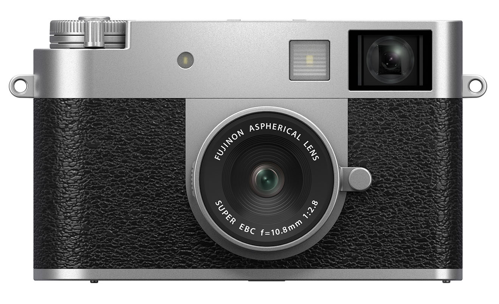

[Dante Stella - Fujifilm announces Fuji X Half 2 digital camera](https://themachineplanet.wordpress.com/2025/05/22/fujifilm-announces-fuji-x-half-2-digital-camera/):

> **An innovative subscription service** by which to enter Film Camera Mode, the user must buy a token from Fujifilm that is good for 72 digital exposures. The token is currently priced at $9.99, though certain film recipes will have higher prices. All tokens will expire 18 months from purchase.

Lots of fun features imagined for the next version of Fuji's new X Half camera. Personally, I think the camera is silly and looks it. I dislike vertical photos (aka "Portrait orientation") so this is not a camera for me. At all. However, I'm tickled that something like the X Half exists. It doesn't hurt anyone, and some people will probably love it. Don't be a hater.
