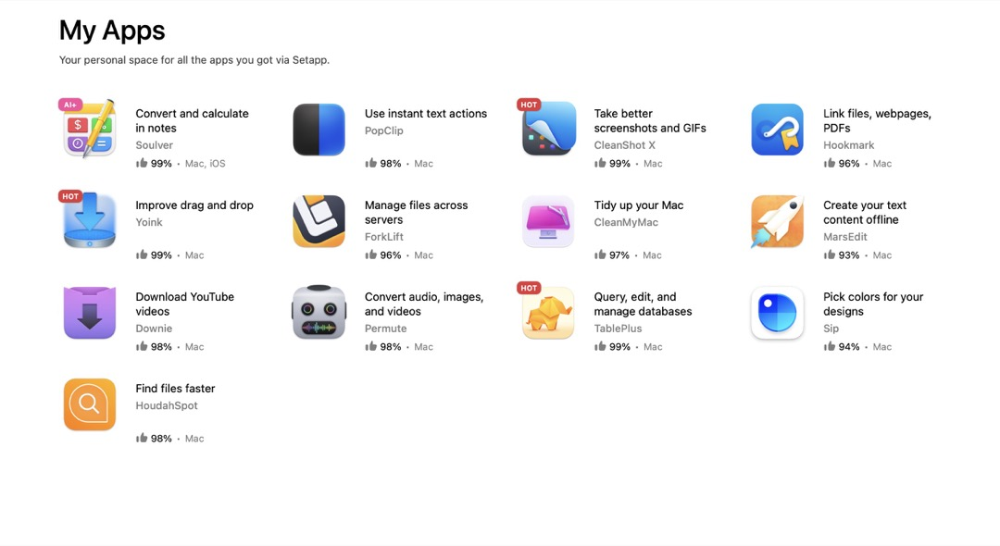

At $10/month, [SetApp](https://setapp.com) is a good deal, especially if you use more than a handful of the included Apps. I've been a subscriber since early on. 

I have two Macs, so the subscription is $15/month. Still a good deal, but I did the math and realized that I could purchase most of the apps I use outright for less than a 1-year SetApp subscription for a single Mac.

This wasn't always the case. For a while there, I had a couple dozen apps installed. My goal this past year has been to whittle that down to the essentials. Here's what I ended up with as of this morning.

Not bad, but after this morning's [App uninstall fiasco](https://social.lol/@jbaty/114642254709480245), I thought I'd see how many more apps I could live without. After all this, I feel like I only _need_ Forklift, and Popclip, so those are the only things I've purchased individually so far.

Eventually I'll probably cave and buy [Soulver](http://soulver.app), because it can be super handy for some things. And I'm sure I'll miss [HoudahSpot](https://www.houdah.com/houdahSpot/), but for $6, [Find Any Fil](https://findanyfile.app)e is a reasonable substitute for the way I use it.

So, I've canceled my SetApp subscription. This has already given me the FOMO jitters, but I'm trying to resist the feeling as long as I can.

