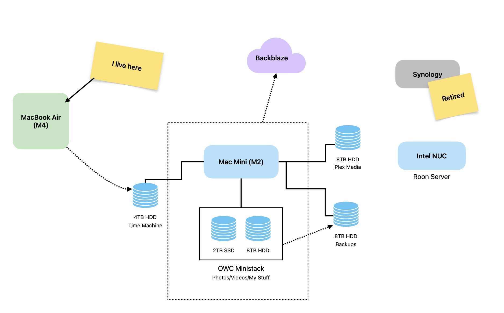

The plan was to only use [one computer](https://baty.net/posts/2025/06/one-computer/) so that I could stop thinking about syncing and software updates and backups and so on. That one computer needed to be portable. I had a 2021 MacBook Pro, but I traded it in for a new **M4 MacBook Air** (w/24GB and 1TB HDD). The MBP is still perfectly fine, but I wanted newer and smaller/lighter. I set the Air up "from scratch", and, after a few painful days, it's starting to feel like a usable machine that has most of my "stuff" on it.

My "One Computer" setup involves several computers 😁.

1.  MacBook Air (M4) - Primary
2.  Mac Mini (M2) - Home server
3.  Intel NUC - Roon server
4.  Synology - (retired)

The **Mac Mini (M2)** has been moved into a home server role. The Mini has an [OWC Ministack](https://www.owc.com/solutions/ministack) enclosure hanging off it loaded with a 2TB SSD and an 8TB HDD. These drives contain all my RAW files/videos/archives/etc. Both drives are a just little over half full, so I have some room there. I decided to renew my Backblaze subscription and have it back up the Mini and both the drives in the Ministack. It's $100/year to have all my important stuff backed up remotely. Even though I still clone the backup drive to another HDD and carry it offsite manually, Backblaze is a good value for the size of the backups and the piece of mind it brings.

There are 3 other drives attached to the Mini...

There is an 8TB HDD, to which I copy everything from the Ministack every night using [Carbon Copy Cloner](https://bombich.com/). These are my local backups.

To avoid having to plug an external drive into the Air for Time Machine backups, I attached a 4TB drive to the Mini for use as a Time Machine drive.

And finally, the Mini is home to my Plex server, so I plugged another 8TB HDD into it for Plex media. So far, this drive is not backed up anywhere. I *could* include it in the Backblaze backups, but it just seems like too much. Honestly, if I were to lose that drive, I wouldn't be out anything I couldn't replace. It's not like I throw my DVDs away after ripping them. 90% of everything is available for streaming anyway. Plex is more because I like how it *feels* to play movies from inside the house.

That leaves 2 other computers on my shelf.

There's a little **Intel NUC** running my [Roon Core](https://roon.app/en/core). It's been running flawlessly for years, so I'll leave it be until it dies. The actual music files are backed up elsewhere. If it dies, I'll install Roon on the Mini and that will be one less computer to think about.

I'll be retiring the **Synology**. It's going on 10 years old and at this point it's redundant. What I may do is pull the (2) drives out of it and put them in a cheap enclosure with RAID for my Plex media. I know, I know, RAID Is Not a Backup™, but it's better than a single drive on its own, and we've already established that I'm not too worried about it.

One flaw I see here is that there's no explicit offsite backup of the Air. Nearly everything on that computer is synced via iCloud, so I'm not too concerned about this yet.
Technically, I'm not down to "One Computer", but the goal was to only use one computer, so I think I'm good.
