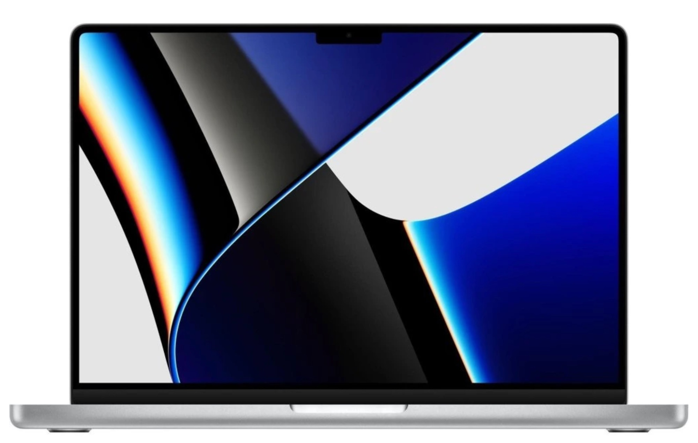
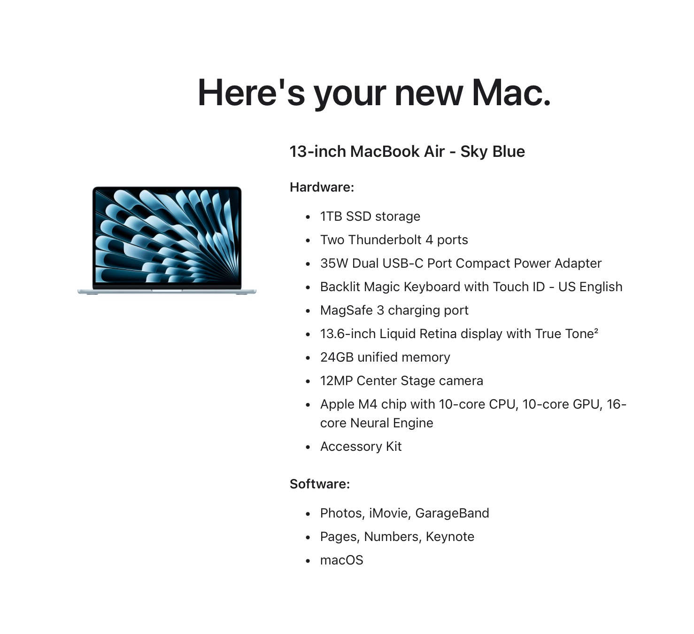

I spend most of my computer time at the Mac Mini (M2) on my desk. I also have a 2021 MacBook Pro that I use occasionally, when I'm looking for a change of pace.

If I only used the stock Apple or cloud-based apps and didn't do anything fancy, having two computers would be fine, but I do neither of those things. I tweak the shit out of everything all the time. This means copying configuration changes between both machines. Sometimes this can be done via iCloud or symlinks or something, but it's still something I need to think about.

Other things I deal with when using multiple computers are: backups, Homebrew installs, OS and application updates, software licenses, etc. I have a whole routine that I run weekly on *both* computers.

Yesterday, there were suddenly dozens of Syncthing conflicts I needed to sort through. Syncthing normally runs like butter, so this was an unwelcome surprise.

I started thinking about all these hassles and how they'd mostly disappear if I only had one computer. So, that's what I've done.

I got everything up to date on the MBP and unplugged the Mini. I have two USB-C docs attached so that all I need to do to connect the MBP is to attach the MagSafe connector and one USB-C cable. I run docked and in clam-shell mode 75% of the time, so popping it in and out doesn't happen much anyway.

The current plan is to move the Mini to a "Network File Server" role, which probably just means Plex. I'll retire the 10-year-old Synology. Technically, I'll still be dealing with another computer, but that's fine. Using two computers for the same things is the problem.

Part of me wishes that my One Computer could be a nice, repairable Linux (or even \*BSD) laptop, but that's just not feasible. I'm a Mac guy for now.

UPDATE: My One Computer is about to be an M4 MacBook Air...

