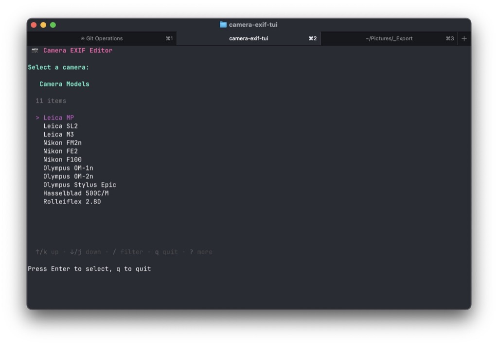

I like to have Make and Model information available in film scans, and use exiftool for this. I have a lisp function in Emacs that does this, but sometimes I'd like to do it from a terminal instead.

So I asked Claude for help. The result was [camera-exif-tui](https://github.com/jackbaty/camera-exif-tui). It's a tiny Go app that launches a TUI that allows me to select a make/model and a folder full of image files. It calls exiftool and updates the images with the selected camera info.

There's a cameras.yaml file in `~/.config/camera-exif-tui/cameras.yaml` with my cameras configured.

```yaml
cameras:
  # Leica Cameras
  - make: Leica
    model: MP
  - make: Leica
    model: SL2
  - make: Leica
    model: M3

  # Nikon Cameras
  - make: Nikon
    model: FM2n
  - make: Nikon
    model: FE2
  - make: Nikon
    model: F100

  # Olympus Cameras
  - make: Olympus
    model: OM-1n
  - make: Olympus
    model: OM-2n
  - make: Olympus
    model: Stylus Epic

  # Hasselblad Cameras
  - make: Hasselblad
    model: 500C/M

  # Rolleiflex Cameras
  - make: Rolleiflex
    model: 2.8D
```

These quick, handly little scripts are ideal for AI. People seem to ignore this when railing against LLM use. The whole thing, including writing the README file and setting up the git repo took less than an hour. I would _never_ have bothered with this without something like Claude. It was _fun_! I don't want to learn the details of Golang, but I'm happy to tweak whatever Claude spits out. Now I have something that I wouldn't have had before, and it was easy to do. I don't care if it's "correct" or not. It works for me.


