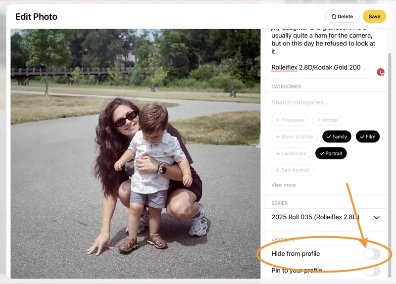

[Glass](https://glass.photo) is a nice way to host and share photos. I've used Flickr for 20 years, so I didn't think I needed Glass, and planned to let my subscription expire.

The single most frustrating thing with Flickr is that there's no good way I know of to keep a public photo off my profile/timeline. If I want to dump a bunch of images to some album, they _all_ show up on my profile. It's always bothered me.

Playing with the new(ish) "Series" feature in Glass, I noticed that there is an option to "Hide from profile".

That's all I ever wanted from Flickr. And while Flickr is still the best way to share and host photos, it's no longer much of social spot. This is such a shame, but here we are.

So I started thinking. What if I could replace my "Film Roll" posts on the blog with links to the Series on Glass?

Like this: [2025 Roll 035 (Rolleiflex 2.8D), a Series by Jack Baty](https://glass.photo/jbaty/series/5tWobLH7kM7T4kh37DrEzB-2025-roll-035-rolleiflex-2-8d).

That lets me use a nice, social photo sharing platform for my film rolls, without needing to maintain a separate photo blog, or deal with posting photos here using Hugo.

Yes, I know, "What if Glass shuts down!?" Fair point, but I don't think I'll worry about it right now. Let's try it.
