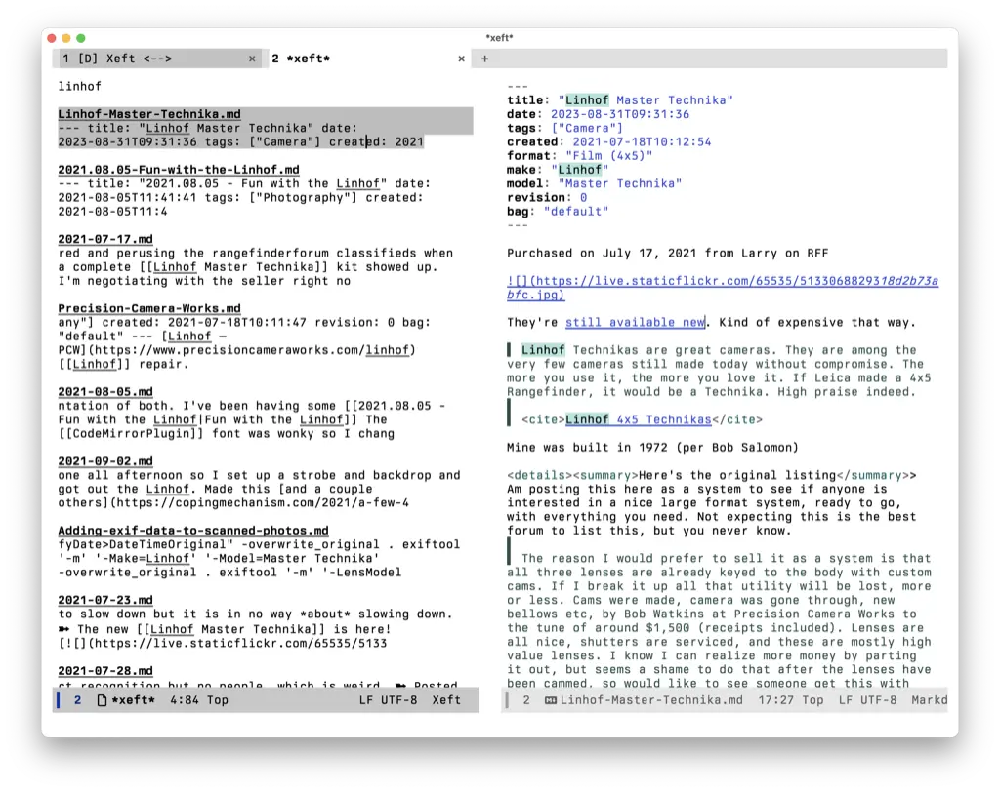

The other day, I converted my entire TiddlyWiki into an Obsidian vault, just to see if I could. Since I still spend most of my time in Emacs, I thought it would be nice to search the vault from there.

The post, [From Obsidian to Emacs](https://mike.hostetlerhome.com/from-obsidian-to-emacs), by Mike Hostetler, mentioned using the [Xeft](https://github.com/casouri/xeft) package, so I thought I'd try it. Here's my config:

```lisp
(use-package xeft
  :ensure t
  :defer t
  :config
  (setq xeft-recursive t)
  (setq xeft-database "~/.deft.db")
  (setq xeft-directory "/Users/jbaty/Documents/Notes/Vault/")
  (setq xeft-ignore-extension '("png" "jpg" "jpeg"))
  (setq xeft-extensions '("md"))
  (setq xeft-title-function #'file-name-nondirectory))
```

Xeft relies on Xapian for searches, so a module needs to be downloaded or built locally. I didn't have any luck with the downloaded version, so I deleted the package, started over, and had it compile locally. The trick there was entering the prefix "/opt/homebrew" during installation, since I'd already installed Xapian using Homebrew.

Here's what a search for "linhof" looks like:


