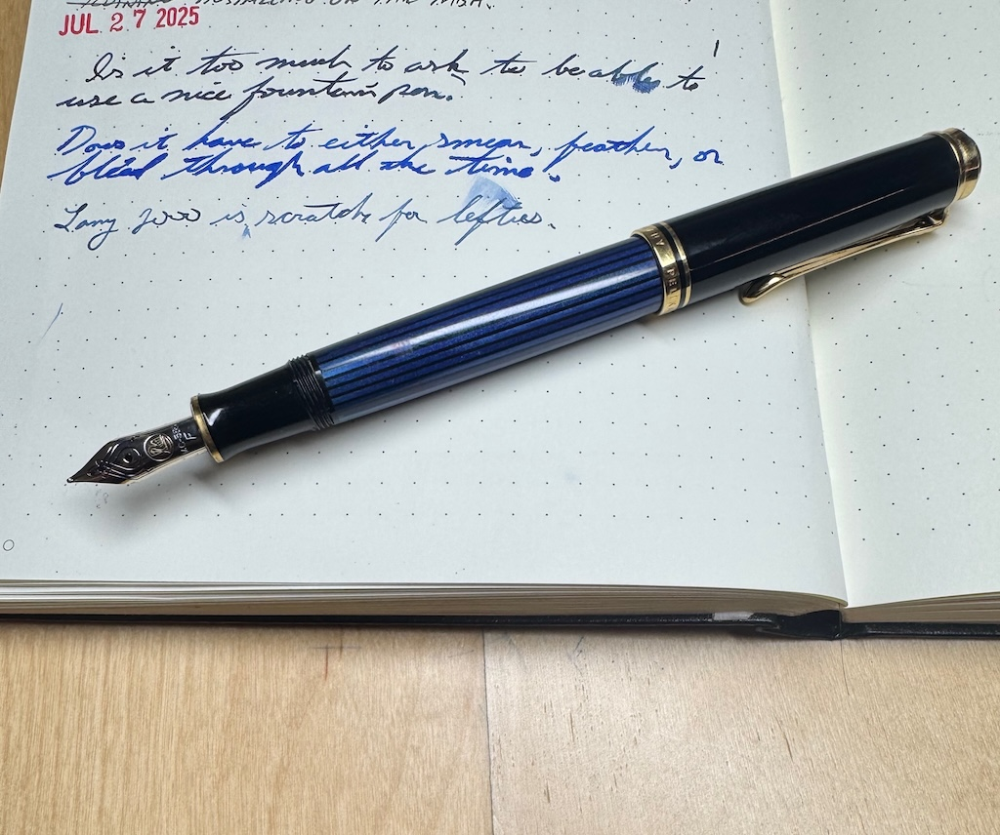
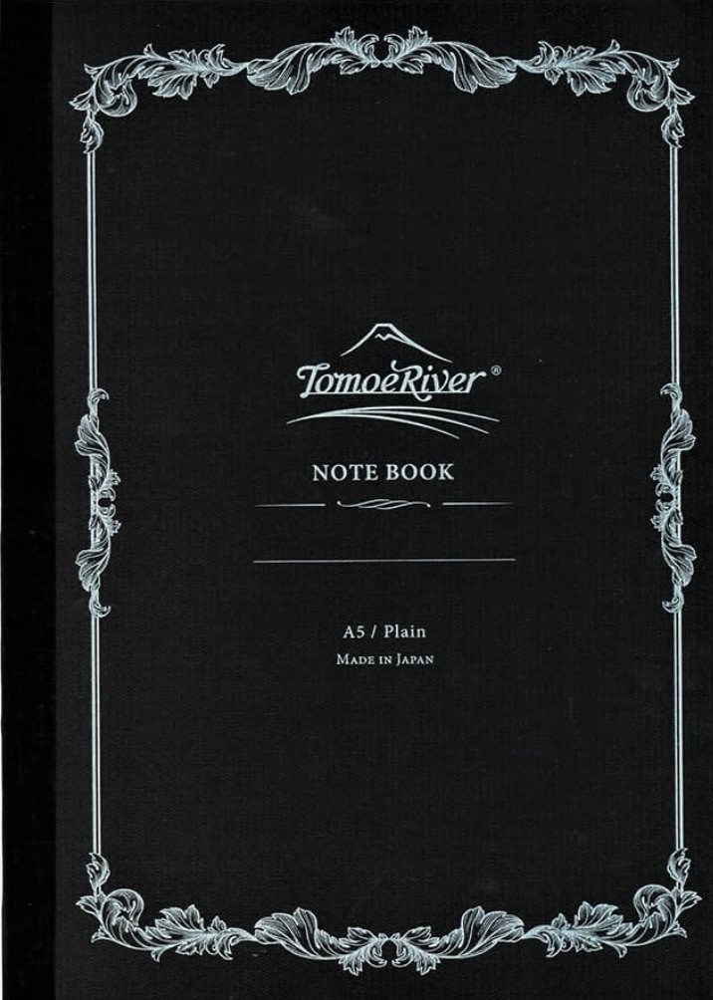
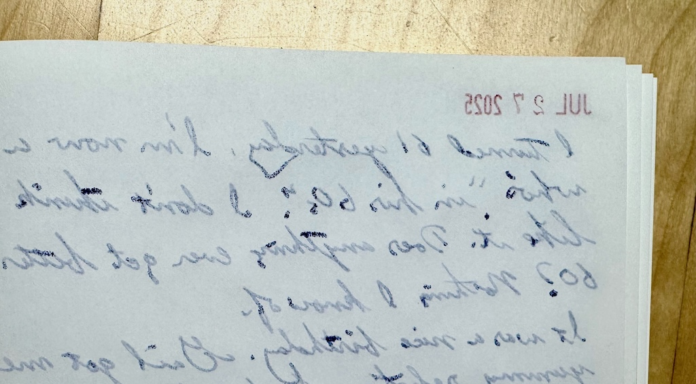

As a lefty, I've always been at a disadvantage when it comes to writing with nice pens in paper notebooks. Writing on paper means dealing with the overhand hook, smeared ink, ring binders getting in the way, scratchy fountain pens, etc. I'm used to it.

My daily notebook is the popular Leuchtturm 1917. I'm using the 120g version, because I dislike bleedthrough and that's some big fat paper. My mistake was ordering the dotgrid version. I chose dotgrid because I tend to use it like a Bullet Journal, and often like to line things up, vertically. The problem is that the dotgrids use 5mm spacing. That's too small. Squeezing a row of cursive handwriting into a 5mm space using my medium-nib fountain pen isn't working. I'm learning that I prefer 7mm ruled pages, Or maybe blank pages.

Someone on YouTube mentioned that they love the Tamoe River notebooks. I've been a fan of Tamoe River paper for many years, so I [ordered a blank one](https://www.amazon.com/dp/B0CBV2W6L7?). 

The idea was to use it for free-form morning writing. I grabbed a couple of my favorite pens, loaded with my favorite ink, and wrote a couple of pages. Then I looked on the reverse of one of those pages, and saw this mess:

My copy must be defective, because otherwise the "new" Tamoe River paper is no longer suitable for fountain pen use. That would be a shame. So now I'm writing in the new notebook with a pencil, which of course works fine, but seems like a waste of what should be a great fountain pen notebook.

I got so frustrated that I slammed my notebook(s) closed and put them up on a shelf, saying, "That's it for now. My journal goes digital!" I'll get over it and probably start all over again tomorrow, I love pen and paper, but it sure can be frustrating.

