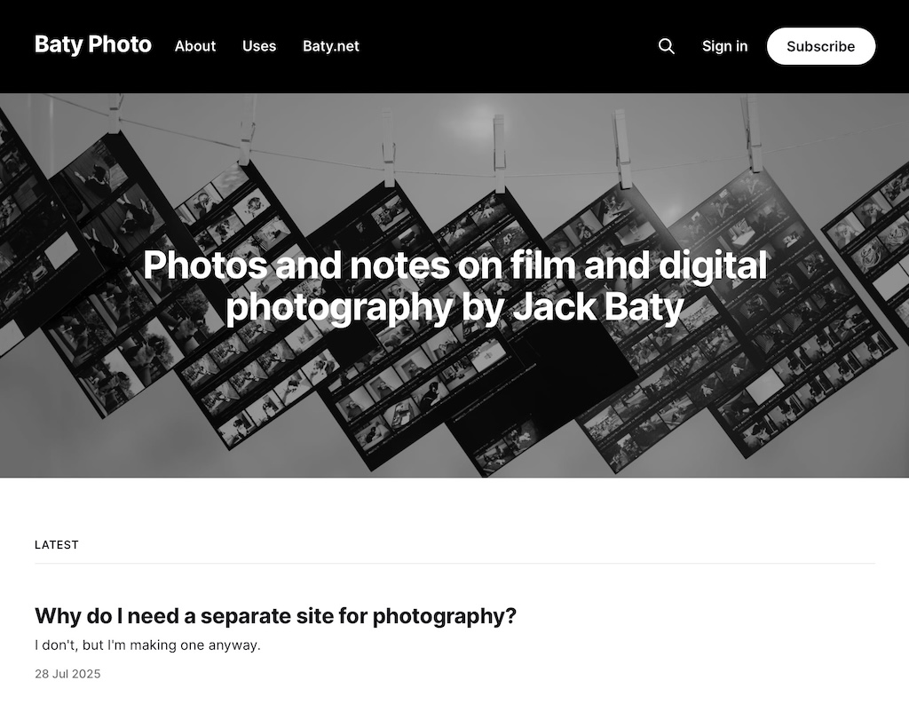

I've rejiggered the Ghost blog I was using for this site into a [dedicated photography blog](https://baty.photo). There's a lot of cruft scattered about, and I'm using the default theme for now, but it's a start.

The idea is that it will help me focus on photography, which is something I _want_ to do, but haven't been doing. Sometimes I need a nudge, so [baty.photo](https://baty.photo) is a nudge.

See [Why do I need a separate site for photography?](https://baty.photo/2025/why-do-i-need-a-separate-site-for-photography/) for a bit more detail.

Follow on the Fediverse using @jack@baty.photo if you like.
