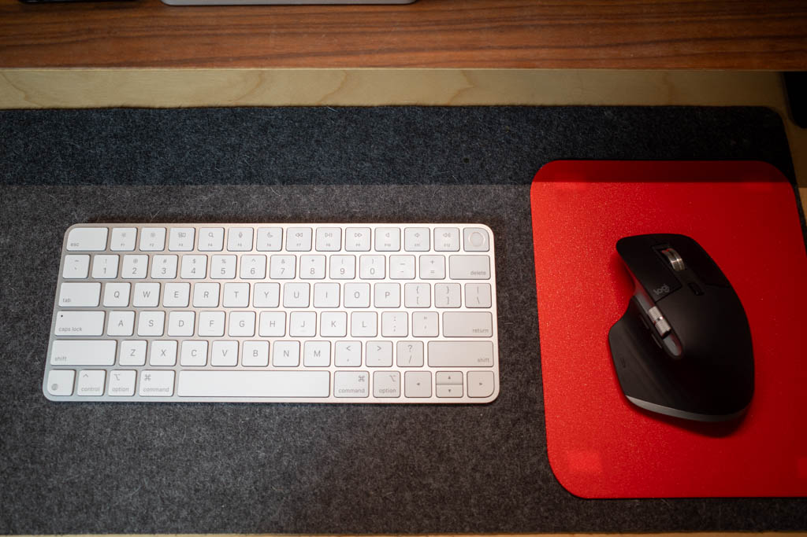

Switching between the MacBook Air keyboard and the HHKB keyboard can be off-putting. I have loved using the [HHKB for years](https://archive.baty.net/2018/the-happy-hacking-keyboard-professional-2/), but I've lost patience for the function layer and missing arrow keys. My pinky hurts too often.

I've been using an Apple Magic Keyboard and Logitech MX Master 3, and, while I love the mouse, the keyboard was boring, but fine, except the spacebar would intermittently fail to register. That's annoying.

On a bit of a whim I made the decision to go all in with Apple's keyboard, so I picked up a new Magic Keyboard with Touch ID, and a Logitech "MX Master 3S for Mac" to go with it. My old mouse works, but is so worn and gross that I thought it was time for a new one. You know, while I was shopping anyway.

I love having Touch ID on the keyboard, especially since I've not been wearing my Apple Watch as often.

I thought about going with some new fancy-keyboard route, but this is practical, simple, and done. It's fine, and now I can stop thinking about my keyboard so much.
