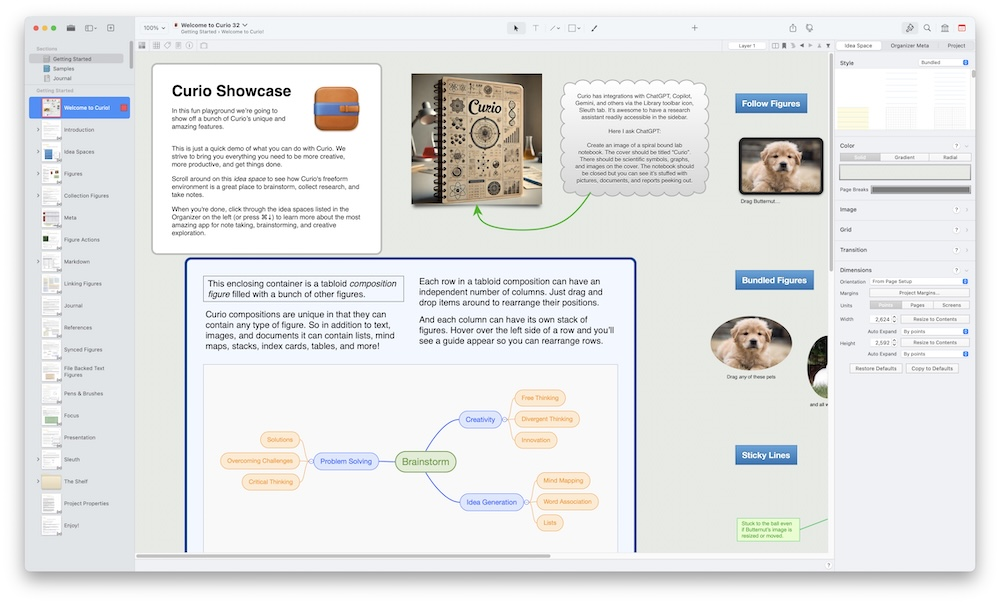

Every year I renew my subscription to [Curio](https://www.zengobi.com), even though I haven't used it much recently. I renew mostly to support development of one of the nicest, most thoughtful apps on macOS, but another reason is that George continues to add truly useful and interesting features year after year. I don't know how he does it.

Check out the [Curio 32 Release Notes](https://www.zengobi.com/curio/releasenotes/?v=32) for details.

Standouts for me are multiple project windows and improvements to Journal sections. I don't need another journaling tool, of course, but I often consider it.

