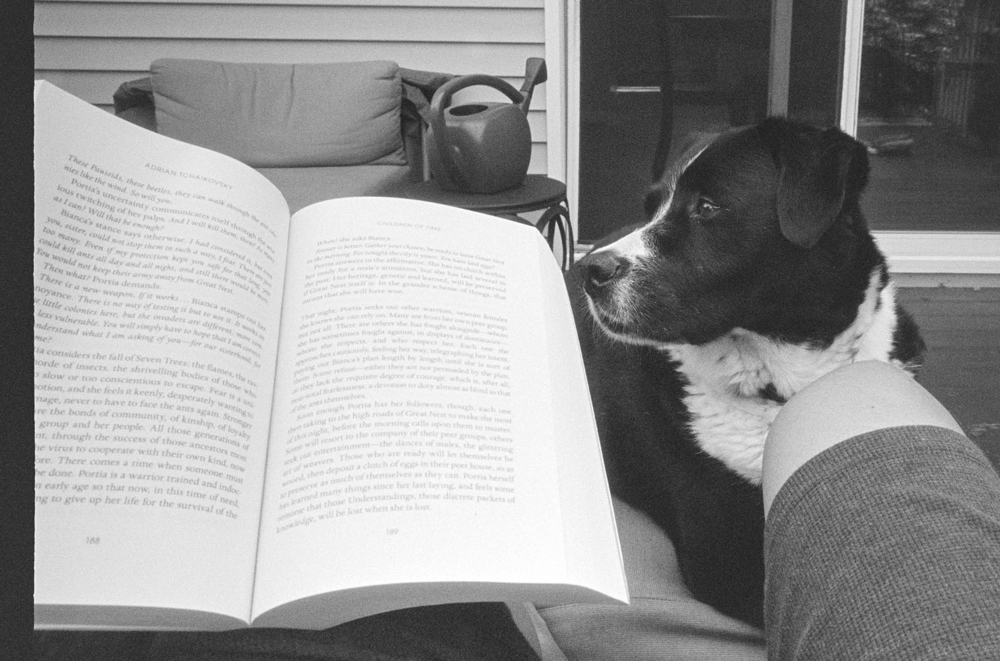

The Ricoh GR1 looked sad in the "broken camera" drawer, so I loaded it up with a roll of HP5 and gave it a shot. It worked just fine. This time. Sometimes the LCD stops working. Sometimes the viewfinder gets blocked by something loose inside the camera. Usually it's both those things, but this time I got through the roll without issue. It's a great camera when it works.

