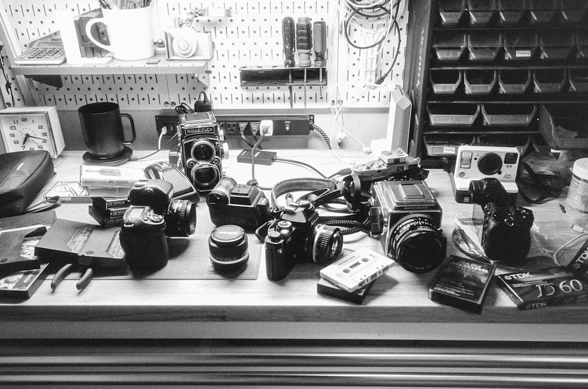

For the past week or so, I've been thinking about shelving the whole film photography thing for a while.

I have many film cameras, but that's the fun part, not the problem. It's the supporting cast that wears me down. There's just too much infrastructure around film photography.

If you'll allow me a bit of a ramble.

First, there's buying the actual film. It's damn expensive, and becoming more so. I have to decide on black and white or color, fast or slow, modern or classic, etc. Best to have a little of each, right? And it's all taking up room in my fridge.

I develop my film at home, so I need all sorts of processing gear and chemicals. Oh, and a darkroom if I want to make prints, which I do. For printing, I have enlargers, lenses, holders, easels, trays, tongs, chemicals, drying racks, paper, a paper safe, safelights, timers, loupes, and on and on. It's a lot.

After the film is processed, there's the scanning. Scanning sucks. Should I use a flatbed, dedicated scanner, or digital camera? I have all three, since I keep trying different approaches. I don't love any of them, but digital scanning is the way forward. That's a whole thing, though. I have a copy stand, but it's terrible, and I hate having to set everything up each time. Is everything level? Don't forget to set the ISO correctly, and focus precisely, and make sure the room lights are off. Which film holder is the best? Digital scanning is the only reason I own a macro lens.

Digitally scanned images need inversion. This means I need to keep a copy of Lightroom Classic around just for running Negative Lab Pro, which I _also_ need because there are no decent alternatives. After scanning, I now have both the original DNG and the NLP-converted positive. Should I keep the original? I shouldn't need to, but I do. Just in case. That's an extra 80MB or so per image, and and they're all just cluttering up the joint.

After everything is scanned, I have to cut and file the negatives. I print a contact sheet and both the sleeve and contact sheet need to go in binders on a shelf. Organized. Forever.

When I review a roll of the scanned images, I find scratches, dust, light leaks, water spots, poor exposure, accidental exposures, etc. Oh, and about a million mirror selfies, for some reason.

When I've had it up to _here_ with all this, I start shooting more digital. All I need is a camera or two, SD cards, my computer, and a printer with supplies. It's so fast and easy! I can load up the photos in Capture One (or whatever) and see them right away. This means I can immediately begin deciding how I want to process every single image. Should I convert it to black and white? Which film simulation would be best here? Maybe I should take it into Photoshop for some frequency separation so I can get it perfectly sharp in all the right places. Does the white balance look right? Maybe just a tad warmer would look better. I should buy more presets!

Best to zoom to 200% to make sure I nailed the focus and that everything is pin sharp... then add some grain in post so they don't look so "clinical". Why'd I spend $4,000 on a lens, again? Sigh. 🙄

As a result of all this, I spent a lot of time looking through my catalog this week. I realized something. I realized that 90% of the time I prefer the film images, as "poor-quality" as they are. I remember that, with film, once a frame is scanned, that's it. Maybe I'll tweak contrast or crop a bit, but basically each frame is what it is. A black and white film photo is always black and white. Converting digital color photos to black and white feels wrong. Fake. And deciding when to convert and when not to is crazy making. I get lost in it.

All this to say...

Even though the process of shooting film can get on my nerves, and the results can be terrible, I prefer film images. I like the fact that they're on film and made by chemistry and light. They're immutable.

Maybe one day I'll feel differently, but right now I'll just have to learn to deal with the infrastructure and get on with it.

