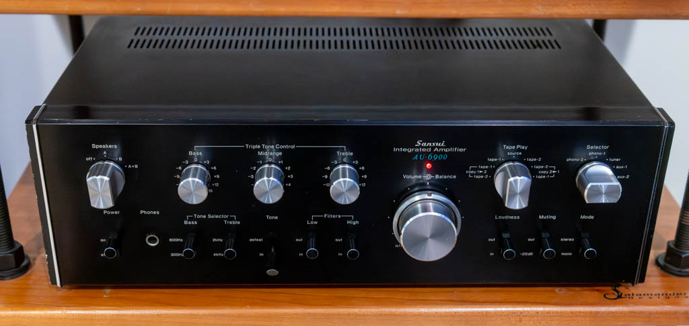
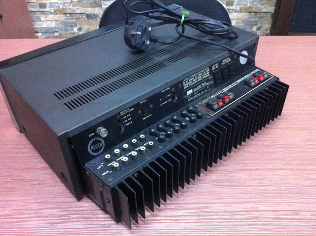

A few weeks ago I swapped an unused turntable and receiver for a nice Nakamichi cassette deck. I paid a little too much in the deal, but I got rid of stuff I wasn't using and gained something I wanted, so it was fair enough. 

Playing with the old cassette deck got me charged up about vintage audio.  I was suddenly bored by the Rega Brio3 (2007), which I bought new. It paled next to some of the cool vintage stuff on display at the new vintage audio store near me, [Bring Back Analog](https://www.bringbackanalog.com/). Plus, the Brio didn't have a headphone jack, which always bothered me. Besides, something from 2007 isn't "vintage", it's just old. So I started shopping.

I traded the Rega and some cash for a shiny new (to me) Sansui AU-6900 from 1976. It's been playing non-stop since I brought it home. I'm no audiophile, but I love it. It sounds great, and looks gorgeous. I'm a sucker for big, shiny knobs and the Sansui has big, shiny knobs. 

Something cool about it is that the rear jacks are situated horizontally. This makes them easier to reach and presumably has other positive effects. I wonder why we don't see more of that.

There's something about listening to beautiful devices made half a century ago. They may not objectively sound better, but they definitely feel like they sound better.
