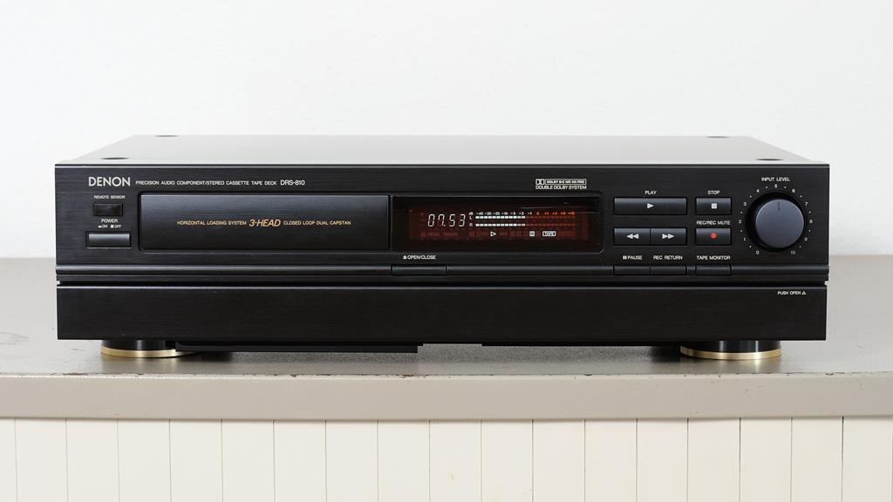
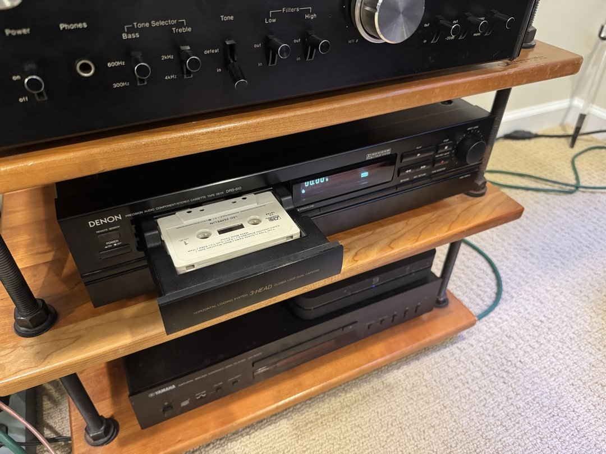

The Nakamichi cassette deck I got in trade for my Thorens turntable ended up DOA. They tried twice to fix it, but no luck. It's a combination of motor and some other hard-to-source parts. Rather than wait around for it, I was given a choice of several other decks instead. 

I picked this weird-ass 3-head Denon DRS-810 with a *drawer* for the cassette. It's technically a better deck, and the drawer mechanism is solid and cool, but it might be a little modern for me (90s). Plus, I like when I can _see_ the music, and with this one, the cassette is hidden while playing. I decided that I don't mind that so much, since in day to day use, the deck is on the other side of the room, anyway. 

I'll tinker with this one for a while and see how it feels.  I was told I can bring it back for a different one any time if it doesn't work out. 

I've only listened to a few tapes in it, but it sounds great to me. Cassettes are fun! And they sound much better than I remember.

