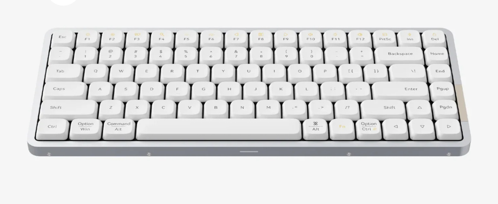

I've been using an HHKB [since 2018](https://archive.baty.net/2018/the-happy-hacking-keyboard-professional-2/) and it's a great keyboard. Once in a while I tire of not having actual function or arrow keys, so I try something else.

The keyboard-driven nature of [Omarchy](https://omarchy.org) has, er, forced my hand again.

Keyboards are a rabbit hole I didn't want to go down again, so I grabbed something that I've seen recommended by a few people and ordered one. Also, although DHH is not someone I'd deliberately try to emulate, it's what he uses with Omarchy, so I figured the odds of it working well were pretty good.

I went with a [Lofree Flow84](https://www.lofree.co/products/lofree-flow-the-smoothest-mechanical-keyboard)

I'll miss the Topre switches on the HHKB, but the Flow's switches feel pretty good. Different, but good. Oddly, I like that it's not very customizable. With any luck, I'll just type on it rather than futzing with custom caps or layouts.

What I don't like is the printing on the keys. Rather than putting the shifted character above the default character, they're laid out side by side. It's weird and I'm not a fan. Also, a few keys have parts printed in a different color. I keep thinking I've dropped crumbs on the keys.

The worst thing is that when rebooting, I can't type in my password when using Bluetooth. I'm using it wired, so it's not a problem for me, but still not ideal.

Otherwise, I'm happily thwocking away over here on my new keyboard. Function and arrow keys are handy, btw. :)
