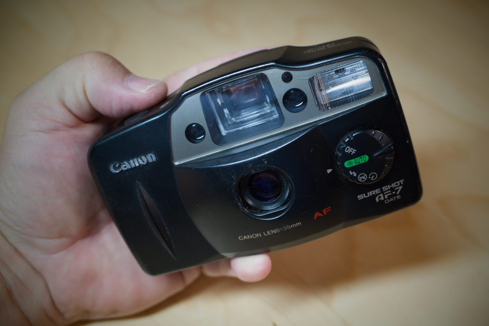

It's nice having a pocketable point-and-shoot film camera with me. Normally for me, this either means an Olympus Stylus Epic or Ricoh GR1. Both of these are having issues, so I impulse ordered a Canon Sure Shot AF-7 from eBay. It was $30 shipped, so there wasn't much risk.

Here's a self-portrait using the self-timer from the first roll (Kentmere 400) through the new camera:

As you can see, it's not terribly sharp and some frames (like this one) show a light leak. Still the camera is so simple to use that it almost makes up for those shortcomings. I still like having a built-in flash and miss it on other cameras. I like the snapshot aesthetic.

I'm not sure how often I'll end up using the AF-7, but it's fun to have around and cost very little.

Oh, and here's a fun review: [Canon Sure Shot AF-7 review: The ‘Owl’ that’s a hoot to shoot | Kosmo Foto](https://kosmofoto.com/2025/09/canon-sure-shot-af-7-review-the-owl-thats-a-hoot-to-shoot/)

