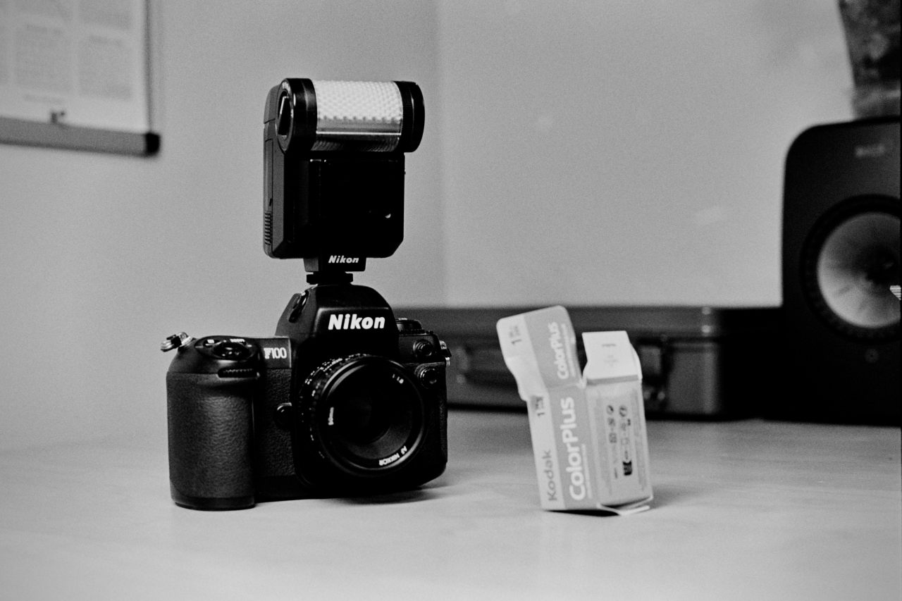

I’m becoming a fan of this awkward kit. The F100 is such a sleeper and can be had relatively cheaply. I ended up with that weird-looking SB-20 flash as part of a local Facebook purchase. There might be something to this TTL flash, auto-focus, auto-exposure photography thing.
