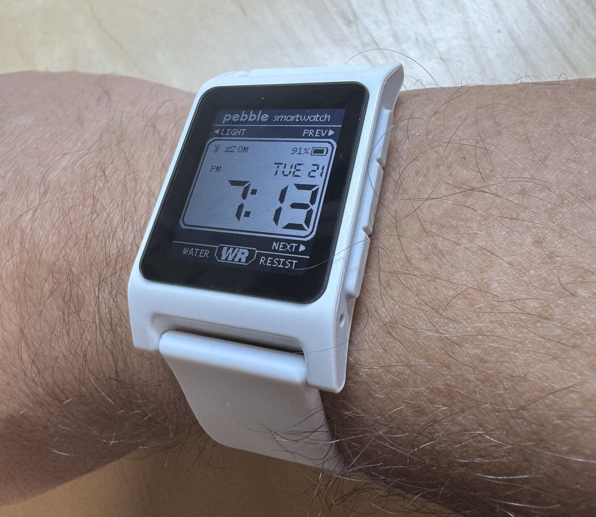

I impulse ordered the [new Pebble smartwatch](https://repebble.com/) as soon as it was announced. At the time, I was looking for excuses to stop wearing my Apple Watch, and this seemed as good as any.

The watch arrived yesterday. It’s very white :). There was no setup to speak of other than downloading the app so I can pick from thousands of faces. That should keep me busy for a while. I love e-paper screens.

I haven’t spent much time playing with everything, but I feel like we’ll get along fine. My only complaint is that there’s no way to rotate the display so that (as a lefty) I can comfortably use the watch on my right wrist.

The only thing I’ve done is to add a Timer app and assigned it to a long press of the middle button. Time, weather, notifications, and timers are my primary uses for a smartwatch, so I’m covered.
